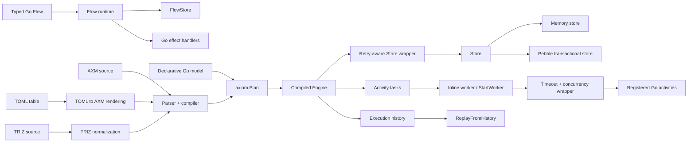
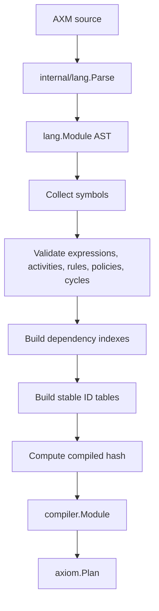
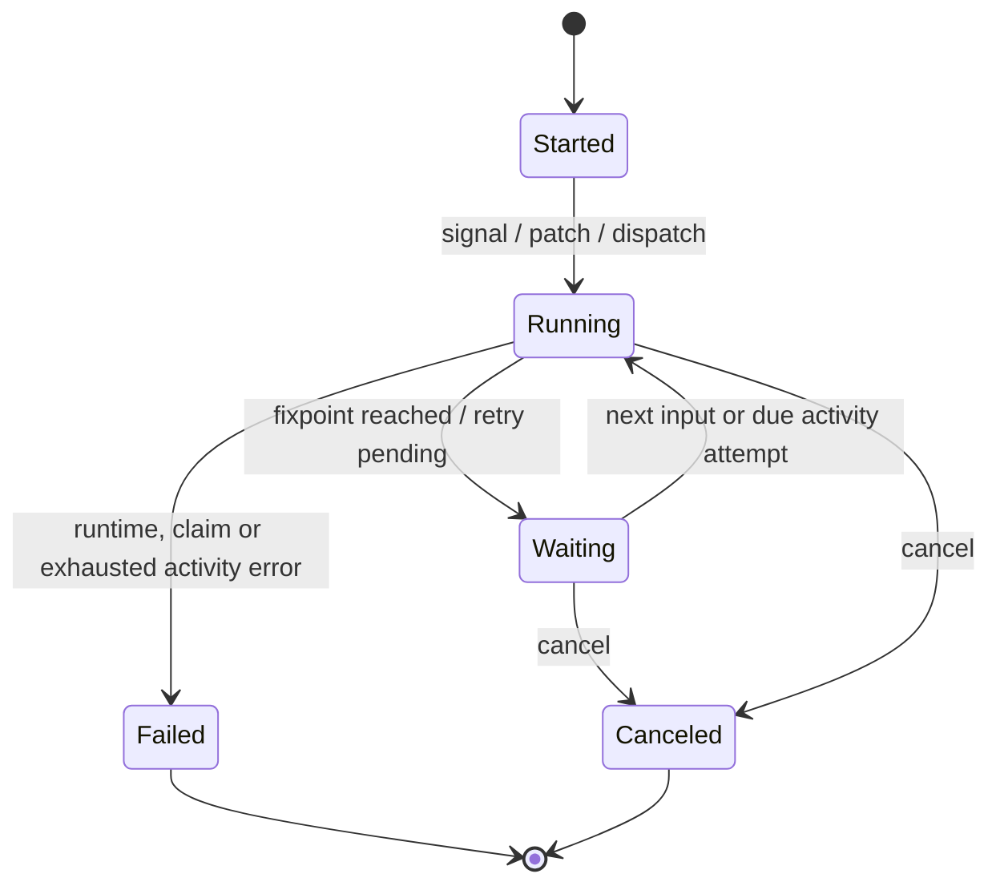
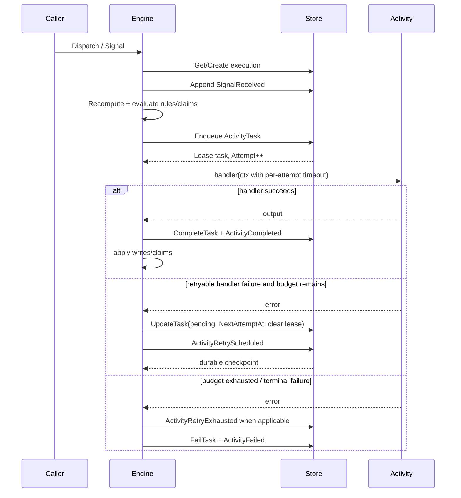

# Архитектура Axiom

## Назначение документа

Документ описывает подтверждённую кодом архитектуру библиотеки Axiom: frontends, канонический `Plan`, compiler/runtime, хранилища, activity boundary, историю и replay.

Он не является обещанием ещё не реализованного поведения. Текущие ограничения вынесены в отдельные разделы.

## Общая схема



## Компоненты

| Компонент | Ответственность | Основные файлы |
|---|---|---|
| Public API | Загрузка, компиляция, options, activity registration, replay | `axiom.go`, `plan.go`, `runtime_aliases.go`, `retry_aliases.go` |
| Typed Go Flow | File-free reducer API с отдельным store и effects | `flow.go` |
| Declarative Go model | Генерация AXM из типизированных Go declarations | `model/model.go`, `model/typed.go`, `model/strict.go`, `model/policy_backoff.go` |
| AXM frontend | Загрузка и компиляция `.axm` в `Plan` | `axm/axm.go`, `internal/lang/*`, `internal/compiler/*` |
| TOML frontend | Разбор таблицы решений и рендеринг в AXM | `table/toml.go` |
| TRIZ normalization | Преобразование пользовательского TRIZ-синтаксиса в AXM v0 | `internal/triz/*`, exported API в `axiom.go` |
| Canonical Plan | Общая форма для декларативных frontends | `plan.go` |
| Compiled runtime | Execution lifecycle, rules, claims, tasks, queries | `internal/runtime/*` |
| Activity attempt policy | Per-attempt timeout и process-local concurrency | `internal/runtime/policy.go` |
| Durable retry orchestration | Retry budget, `NextAttemptAt`, retry history, store wrapping | `internal/runtime/retry_store.go`, `retry_store_dedup.go` |
| Stores | Memory и Pebble implementations | `internal/store/memory/*`, `internal/store/pebble/*`, `store/pebble/pebble.go` |
| Code generation | Типизированные activity boundaries | `cmd/axiomgen/*` |
| Diagrams | Mermaid и PlantUML из module/history | `diagram/diagram.go` |
| Compatibility analysis | Bundle diff и impact report | `bundle.go` |
| Benchmarks | Нагрузочные сценарии и percentile reports | `cmd/axiombench/main.go`, `benchmarks/latest.md` |

## Канонический Plan

`axiom.Plan` содержит имя, версию, digest, формат, уровень анализа и закрытую ссылку на скомпилированный module.

Декларативная Go-модель, AXM и TOML реализуют или используют `PlanSource` и сходятся в одном runtime. Typed Go Flow остаётся отдельным frontend, потому что произвольные Go handlers нельзя полностью статически проанализировать.

Текущие версии compiled artifacts задаются в compiler:

- DSL: `axm/v1`;
- compiler: `axiom-compiler/v2`;
- fast plan: `fast-plan/v2`.

## Компиляция



Компилятор обнаруживает синтаксические ошибки, неразрешённые ссылки, дубликаты, циклы, неверные activity/policy связи и ряд требований к external activity до запуска runtime.

## Execution lifecycle



`StatusCompleted` объявлен в runtime types и поддерживается replay representation, но автоматический переход execution в `Completed` в проверенном execution path не найден. Документация не должна обещать completion rule до появления явной реализации и tests.

`Run.Dispatch`:

1. проверяет execution handle и event;
2. создаёт execution, если он отсутствует;
3. отправляет signal;
4. запускает drain;
5. если activity attempt сохранил retry checkpoint, ждёт `NextAttemptAt` в пределах caller context и продолжает;
6. возвращается после исчерпания доступных inline tasks, успешного completion activity, terminal error или завершения caller context.

Низкоуровневый `Engine.RunUntilIdle` принципиально не ждёт будущий retry: после durable checkpoint он возвращает `ErrRetryScheduled`. Это позволяет внешнему worker/scheduler освободить goroutine.

Операции одного execution сериализуются keyed lock по ID внутри одного `Engine`.

## Обработка signal, task и retry



`timeout` и `concurrency` применяются к одной попытке handler. Retry orchestration находится уровнем выше handler wrapper и использует persisted task state.

## History

Основные entry types:

- `ExecutionStarted`, `ContextPatched`, `SignalReceived`;
- `ActivityScheduled`, `ActivityDeduplicated`;
- `ActivityRetryScheduled`;
- `ActivityRetryExhausted`;
- `ActivityCompleted`, `ActivityFailed`;
- `WriteApplied`, `ExecutionReachedFixpoint`, `ExecutionCanceled`;
- `TraceFull`: `RuleScheduled`, `RuleSkipped`;
- `TraceAggregate`: `RulesEvaluated`.

`ActivityRetryScheduled` означает, что ошибка попытки уже отражена в store и task снова имеет `pending` status с будущим `NextAttemptAt`. Это не terminal failure. `ActivityFailed` появляется только после terminal error или исчерпания retry budget.

## Хранилища и транзакции

### Retry-aware wrapper

`NewEngine` оборачивает любой `Store` retry-aware слоем. Он:

- не меняет persisted schema `ActivityTask`;
- сохраняет быстрый `TaskDedupStore` path (`FindTask`, `NextTaskSeq`), если backend его предоставляет;
- перед polling проверяет наличие due pending task, поэтому memory queue не вращается бесконечно, когда все tasks отложены;
- отслеживает текущий leased task только как process-local вспомогательное состояние для завершения попытки;
- переносит retry checkpoint в сам backend через `UpdateTask` + history.

Если backend реализует `TransactionalStore`, wrapper тоже реализует `TransactionalStore` и создаёт retry-aware transaction wrapper. Retry checkpoint и history коммитятся атомарно. Ошибка commit не маскируется как успешно запланированный retry.

### Memory store

Используется по умолчанию. Durable retry переживает замену `Engine` при использовании того же in-memory store object, но содержимое store теряется при завершении процесса.

### Pebble

Pebble store реализует durable и transactional storage. `NextAttemptAt` входит в ordering pending tasks, поэтому future retry не выдаётся раньше срока. Retry checkpoint переживает закрытие/reopen Pebble store.

Публичные варианты:

- sync по умолчанию;
- `PebbleNoSync` / `WithNoSync`;
- `PebbleSyncEvery` / `WithSyncEvery`;
- JSON или Gob codec.

`WithProductionMode` проверяет, что store реализует `TransactionalStore`.

### Граница транзакции

Execution/history/task updates выполняются через store transaction там, где runtime вызывает `withStoreTransaction`. Внешняя activity находится за границей локальной транзакции: её side effect нельзя откатить после сетевой ошибки или падения процесса.

Поэтому external handler обязан быть идемпотентным по business/idempotency key. Durable retry усиливает, а не отменяет это требование.

## Activity tasks

Activity task содержит execution ID, rule, activity, input, idempotency key, status, `Attempt`, `MaxAttempts`, lease, `NextAttemptAt` и result/error.

Runtime умеет:

- ставить task в очередь;
- выдавать due task с lease и увеличивать `Attempt`;
- восстанавливать просроченный lease;
- дедуплицировать незавершённую или завершённую task по rule/activity/key;
- после retryable failure возвращать task в pending с future `NextAttemptAt`;
- продолжать pending retry через новый `Engine`/worker;
- фиксировать completed или terminal failed result.

### Policy semantics

| Поле policy | Реализованная гарантия | Текущая граница |
|---|---|---|
| `retry` | До `retry + 1` persisted task attempts | Не является exactly-once внешнего эффекта |
| `backoff: 250ms` / `fixed(250ms)` | Fixed delay между attempts | Delay capped runtime-ом 30s |
| `backoff: exponential(100ms)` | Deterministic exponential delay | Cap 30s; jitter пока не является public contract |
| `timeout` | Отдельный `context.WithTimeout` на одну handler attempt | Handler должен соблюдать context cancellation |
| `concurrency: once` | Одна activity сериализуется внутри одного `Engine` | Не distributed lock между process/Engine |
| `concurrency: parallel` | Дополнительная сериализация не вводится | Общие execution/store ограничения остаются |
| `concurrency: latest/first` | Парсится для forward compatibility | Production mode отклоняет `AX508`; supersession ещё не реализован |
| `idempotency` | Для external activity компилятор требует `required` и key; store выполняет task deduplication | Это не exactly-once guarantee внешнего API или оборудования |

Без явного `backoff` retry использует deterministic exponential base `100ms`, capped at `30s`.

## Lease recovery

Если process/worker исчез после lease, но до complete/fail checkpoint, `RecoverExpiredLeases` возвращает task в pending. Следующая lease увеличивает `Attempt`, потому что runtime не может доказать, успел ли предыдущий внешний effect произойти.

Это intentional at-least-once execution behavior для activity attempts и ещё одна причина обязательной идемпотентности external effects.

## Production mode

`WithProductionMode()`:

- требует transactional store;
- включает strict fast runtime;
- разрешает durable `retry`, `backoff`, per-attempt `timeout`, `once` и `parallel`;
- отклоняет `latest/first` через `AX508`, пока отсутствует корректная durable supersession semantics.

## Typed Go Flow

Typed Go Flow — отдельный простой reducer runtime:

```text
load state -> reducer -> claims -> execute effects -> save state and history
```

Критическая граница: effects выполняются до `FlowStore.Save`. Если внешний эффект завершился, а сохранение затем вернуло ошибку, библиотека не может автоматически откатить внешний мир. Поэтому:

- effects должны быть идемпотентны;
- custom `FlowStore` должен иметь понятную модель отказов;
- для durable orchestration с task records предпочтителен compiled runtime.

## Replay

`ReplayFromHistory` восстанавливает execution из history и проверяет module hash. History, созданная другой моделью, отклоняется.

Завершённые activity не запускаются повторно во время replay: используются записанные результаты и writes.

## Границы доверия

1. **Входные events и patches.** Runtime проверяет объявленные signals и типы значений, но бизнес-авторизация остаётся приложению.
2. **Activity handlers.** Это доверенный пользовательский Go-код с доступом к сети, оборудованию и секретам приложения.
3. **Store.** Custom store должен соблюдать контракты атомарности, task leasing, `NextAttemptAt` и history ordering.
4. **Execution ID.** Приложение отвечает за уникальность, маршрутизацию и распределённое владение.
5. **Generated code.** `*_axiom.gen.go` перегенерируется; пользовательская реализация activity хранится отдельно.

## Точки расширения

- `Store` и `TransactionalStore`;
- `FlowStore`;
- `Activity` / `ActTyped`;
- `PlanSource`;
- отдельные frontends поверх канонического Plan;
- tooling через `ModuleBundle`, dependency indexes и package `diagram`.

## Известные ограничения

- нет распределённого lock/owner router;
- `concurrency: latest/first` не имеют task-supersession semantics;
- durable retry обеспечивает at-least-once attempts, но не exactly-once внешний effect;
- автоматический переход в `Completed` не подтверждён execution path;
- runtime dispatch policy `catch:` не реализован;
- wall-clock scheduler для timer triggers не определён как public guarantee;
- Typed Go Flow не имеет статического dependency graph;
- imports разбираются parser, но полноценная загрузка/линковка нескольких AXM modules не подтверждена в проверенном runtime path;
- exported TRIZ API присутствует, но его уровень стабильности должен быть явно определён владельцем проекта;
- отдельного HTTP API, миграций БД и env-based configuration в проекте не обнаружено.
