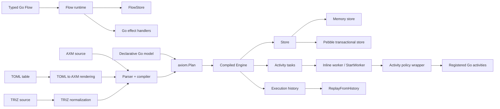
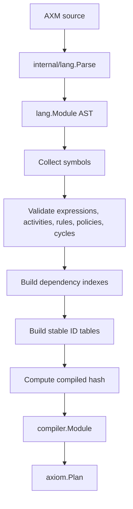
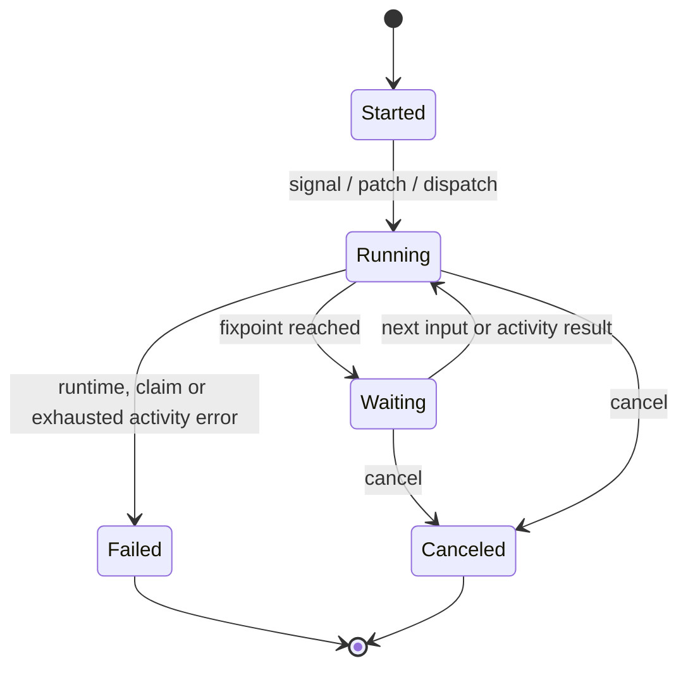
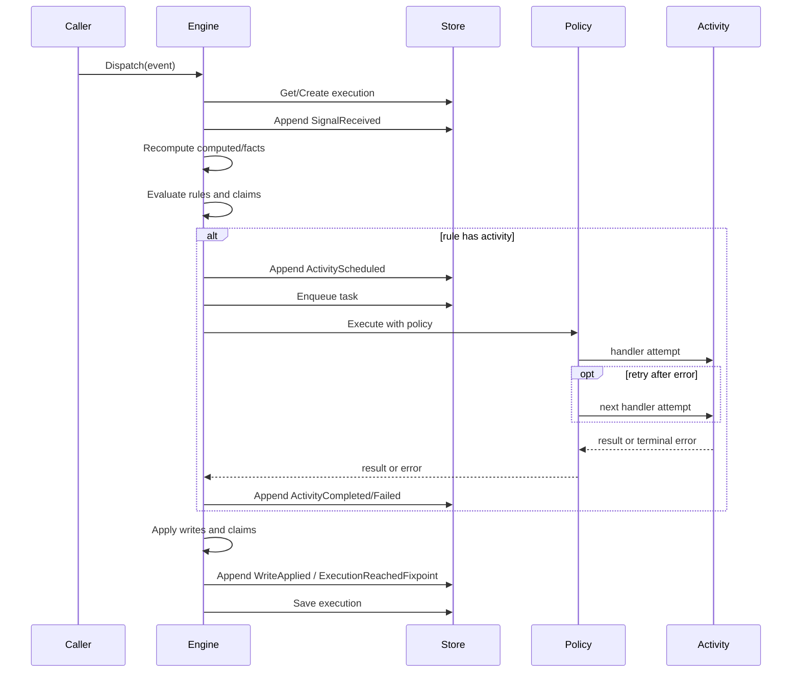

# Архитектура Axiom

## Назначение документа

Документ описывает подтверждённую кодом архитектуру библиотеки Axiom: frontends, канонический `Plan`, compiler/runtime, хранилища, activity boundary, историю и replay.

Он не является обещанием ещё не реализованного поведения. Текущие ограничения вынесены в отдельные разделы.

## Общая схема



## Компоненты

| Компонент | Ответственность | Основные файлы |
|---|---|---|
| Public API | Загрузка, компиляция, options, activity registration, replay | `axiom.go`, `plan.go`, `runtime_aliases.go` |
| Typed Go Flow | File-free reducer API с отдельным store и effects | `flow.go` |
| Declarative Go model | Генерация AXM из типизированных Go declarations | `model/model.go`, `model/typed.go`, `model/strict.go` |
| AXM frontend | Загрузка и компиляция `.axm` в `Plan` | `axm/axm.go`, `internal/lang/*`, `internal/compiler/*` |
| TOML frontend | Разбор таблицы решений и рендеринг в AXM | `table/toml.go` |
| TRIZ normalization | Преобразование пользовательского TRIZ-синтаксиса в AXM v0 | `internal/triz/*`, exported API в `axiom.go` |
| Canonical Plan | Общая форма для декларативных frontends | `plan.go` |
| Compiled runtime | Execution lifecycle, rules, claims, tasks, queries | `internal/runtime/*` |
| Activity policy runtime | Retry, timeout и process-local concurrency wrappers | `internal/runtime/policy.go` |
| Stores | Memory и Pebble implementations | `internal/store/memory/*`, `internal/store/pebble/*`, `store/pebble/pebble.go` |
| Code generation | Типизированные activity boundaries | `cmd/axiomgen/*` |
| Diagrams | Mermaid и PlantUML из module/history | `diagram/diagram.go` |
| Compatibility analysis | Bundle diff и impact report | `bundle.go` |
| Benchmarks | Нагрузочные сценарии и percentile reports | `cmd/axiombench/main.go`, `benchmarks/latest.md` |

## Канонический Plan

`axiom.Plan` содержит имя, версию, digest, формат, уровень анализа и закрытую ссылку на скомпилированный module.

Декларативная Go-модель, AXM и TOML реализуют или используют `PlanSource` и сходятся в одном runtime. Typed Go Flow остаётся отдельным frontend, потому что произвольные Go handlers нельзя полностью статически проанализировать.

Текущие версии compiled artifacts задаются в compiler:

- DSL: `axm/v1`;
- compiler: `axiom-compiler/v2`;
- fast plan: `fast-plan/v2`.

## Компиляция



Компилятор обнаруживает синтаксические ошибки, неразрешённые ссылки, дубликаты, циклы, неверные activity/policy связи и ряд требований к external activity до запуска runtime.

## Execution lifecycle



`StatusCompleted` объявлен в runtime types и поддерживается replay representation, но автоматический переход execution в `Completed` в проверенном execution path не найден. Документация не должна обещать completion rule до появления явной реализации и tests.

`Run.Dispatch`:

1. проверяет execution handle и event;
2. создаёт execution, если он отсутствует;
3. отправляет signal;
4. запускает `RunUntilIdle`;
5. возвращается после исчерпания доступных inline tasks либо при ошибке.

Операции одного execution сериализуются keyed lock по ID внутри одного `Engine`.

## Обработка signal и rule



Точный набор history entries зависит от trace level:

- всегда или в основных путях: `ExecutionStarted`, `ContextPatched`, `SignalReceived`, `ActivityScheduled`, `ActivityDeduplicated`, `ActivityCompleted`, `ActivityFailed`, `WriteApplied`, `ExecutionReachedFixpoint`, `ExecutionCanceled`;
- `TraceFull`: `RuleScheduled`, `RuleSkipped`;
- `TraceAggregate`: `RulesEvaluated`.

Внутренние handler retry пока не создают отдельные history entries. `ActivityFailed` появляется после исчерпания retry budget или terminal cancellation.

## Хранилища и транзакции

### Memory store

Используется по умолчанию. Подходит для тестов и временных execution. Содержимое теряется при завершении процесса.

### Pebble

Pebble store реализует durable и transactional storage. Публичные варианты:

- sync по умолчанию;
- `PebbleNoSync` / `WithNoSync`;
- `PebbleSyncEvery` / `WithSyncEvery`;
- JSON или Gob codec.

`WithProductionMode` проверяет, что store реализует `TransactionalStore`.

### Граница транзакции

Изменения execution, history и task records выполняются через store transaction там, где runtime вызывает `withStoreTransaction`. Внешняя activity находится за границей локальной транзакции: её результат записывается после завершения Go handler.

Это означает, что внешняя система должна поддерживать безопасную идемпотентность по переданному business key. Retry усиливает это требование, потому что один task может вызвать handler несколько раз.

## Activity tasks

Activity task содержит execution ID, rule, activity, input, idempotency key, status, attempt, max attempts, lease и result/error.

Runtime умеет:

- ставить task в очередь;
- выдавать task с lease;
- восстанавливать просроченный lease;
- дедуплицировать незавершённую или завершённую task по rule/activity/key;
- фиксировать completed или failed result;
- применять activity policy перед вызовом зарегистрированного handler.

### Policy semantics

| Поле policy | Реализованная гарантия | Текущая граница |
|---|---|---|
| `retry` | До `retry + 1` последовательных handler-вызовов | Повторы immediate/in-process; нет durable backoff/requeue и retry history per attempt |
| `timeout` | Отдельный `context.WithTimeout` на каждую handler-попытку | Handler должен соблюдать context cancellation |
| `concurrency: once` | Одна activity сериализуется внутри одного `Engine` | Не distributed lock между процессами/Engine |
| `concurrency: parallel` | Дополнительная сериализация не вводится | Общие execution/store ограничения остаются |
| `concurrency: latest/first` | Парсится для forward compatibility | Production mode отклоняет `AX508`; task supersession ещё не реализован |
| `idempotency` | Для external activity компилятор требует `required` и key; store выполняет task deduplication | Это не exactly-once гарантия внешнего API или оборудования |

`ActivityTask.Attempt` сейчас отражает lease/task attempt, а не каждую внутреннюю handler retry-попытку. `MaxAttempts` остаётся частью task model, но текущий immediate retry выполняется policy wrapper-ом до финального `CompleteTask`/`FailTask`.

## Production mode

`WithProductionMode()`:

- требует transactional store;
- включает strict fast runtime;
- разрешает `retry`, `timeout`, `once` и `parallel`;
- отклоняет `latest/first` через `AX508`, пока отсутствует корректная durable supersession semantics.

## Typed Go Flow

Typed Go Flow — отдельный простой reducer runtime:

```text
load state -> reducer -> claims -> execute effects -> save state and history
```

Критическая граница: effects выполняются до `FlowStore.Save`. Если внешний эффект завершился, а сохранение затем вернуло ошибку, библиотека не может автоматически откатить внешний мир. Поэтому:

- effects должны быть идемпотентны;
- custom `FlowStore` должен иметь понятную модель отказов;
- для durable orchestration с task records предпочтителен compiled runtime.

## Replay

`ReplayFromHistory` восстанавливает execution из history и проверяет module hash. History, созданная другой моделью, отклоняется.

Завершённые activity не запускаются повторно во время replay: используются записанные результаты и writes.

## Границы доверия

1. **Входные events и patches.** Runtime проверяет объявленные signals и типы значений, но бизнес-авторизация остаётся приложению.
2. **Activity handlers.** Это доверенный пользовательский Go-код с доступом к сети, оборудованию и секретам приложения.
3. **Store.** Custom store должен соблюдать контракты атомарности, task leasing и history ordering.
4. **Execution ID.** Приложение отвечает за уникальность, маршрутизацию и распределённое владение.
5. **Generated code.** `*_axiom.gen.go` перегенерируется; пользовательская реализация activity хранится отдельно.

## Точки расширения

- `Store` и `TransactionalStore`;
- `FlowStore`;
- `Activity` / `ActTyped`;
- `PlanSource`;
- отдельные frontends поверх канонического Plan;
- tooling через `ModuleBundle`, dependency indexes и package `diagram`.

## Известные ограничения

- нет распределённого lock/owner router;
- retry пока immediate/in-process, без durable backoff/`NextAttemptAt` и retry history per attempt;
- `concurrency: latest/first` не имеют task-supersession semantics;
- автоматический переход в `Completed` не подтверждён execution path;
- Typed Go Flow не имеет статического dependency graph;
- imports разбираются parser, но полноценная загрузка/линковка нескольких AXM modules не подтверждена в проверенном runtime path;
- exported TRIZ API присутствует, но его уровень стабильности должен быть явно определён владельцем проекта;
- отдельного HTTP API, миграций БД и env-based configuration в проекте не обнаружено.
