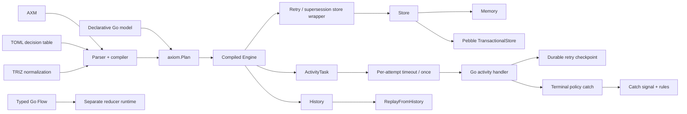
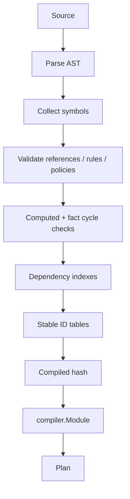
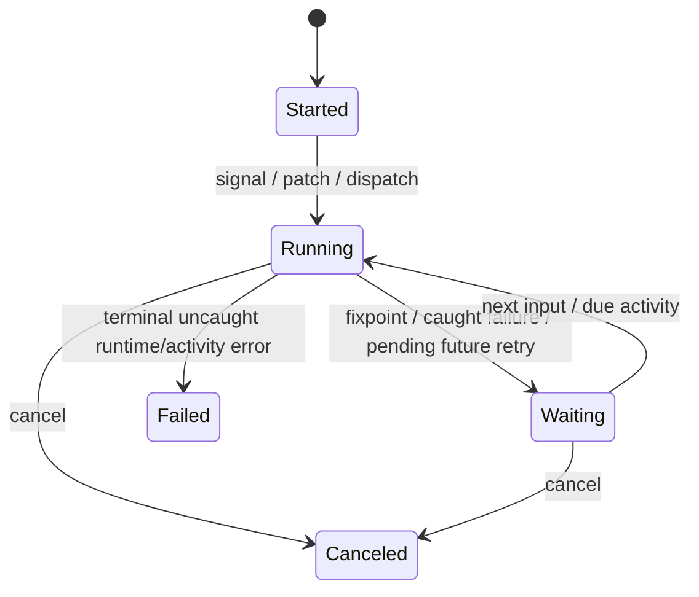
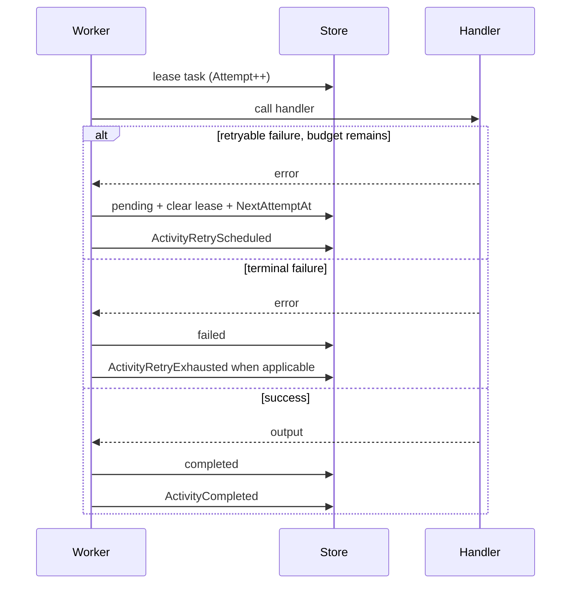

# Архитектура Axiom

## Назначение

Документ описывает фактическую архитектуру текущего `main`: public frontends, канонический `Plan`, compiler/runtime, task orchestration, retry, supersession, policy catch, хранилища, history и replay.

Парсерная возможность сама по себе не считается runtime-гарантией. Актуальные поведенческие границы дополнительно зафиксированы в [`docs/runtime-semantics.md`](docs/runtime-semantics.md).

## Общая схема



## Публичные уровни

### Frontends

| Frontend | Пакет | Analysis | Когда использовать |
|---|---|---:|---|
| Declarative Go | `model` | static | основной путь для нового Go-кода |
| AXM | `axm` / root compile API | static | модель вне Go, tooling |
| TOML table | `table` | static | decision tables |
| Typed Go Flow | root `Flow[S]` | opaque | компактный reducer без статического графа |

Декларативные frontends сходятся в `axiom.Plan`. Typed Go Flow использует отдельный runtime.

### Канонический путь

```text
Definition / AXM / TOML
          ↓
        Plan
          ↓
        Engine
          ↓
         Run
```

`Plan` содержит имя, версию, digest, frontend format, analysis level и закрытую ссылку на скомпилированный module.

## Compiler



Compiler проверяет:

- синтаксис и дубликаты declarations;
- ссылки на context/signal/output/policy entities;
- write targets;
- activity/policy/idempotency requirements;
- policy catch target signal names;
- computed/fact cycles;
- часть strict-fast ограничений.

Canonical `Plan`/`Open`/`New` paths дополнительно ограничивают `runtime.*` query namespace стабильным набором execution metadata и возвращают `AX001` для неизвестных projection names.

## Execution lifecycle



`StatusCompleted` существует в types/replay representation, но автоматический completion rule не является текущей public runtime guarantee.

Операции одного execution ID сериализуются keyed lock внутри конкретного `Engine`. Межпроцессное ownership приложение организует отдельно.

## ActivityTask

Task хранит:

- execution/rule/activity IDs;
- input и idempotency key;
- status;
- `Attempt` / `MaxAttempts`;
- worker lease;
- `NextAttemptAt`;
- result/error;
- timestamps.

Terminal scheduling statuses:

- `completed`;
- `failed`;
- `superseded`.

`pending` и `running` считаются active work.

## Task scheduling и deduplication

Перед enqueue runtime проверяет exact task key через `TaskDedupStore`, если backend поддерживает индексированный путь.

Явный непустой idempotency key дедуплицирует тот же intent до concurrency supersession. Для `first/latest` пустая строка не трактуется как глобальный idempotency key — иначе все unkeyed вызовы схлопывались бы ещё до policy logic.

Retry-aware store wrapper сохраняет индексные `FindTask`/`NextTaskSeq` paths memory/Pebble и не переводит обычный runtime на линейный task scan.

## Durable retry

`retry: N` означает максимум `N + 1` persisted handler attempts.



Backoff forms:

- duration / `fixed(duration)`;
- `exponential(duration)`;
- default exponential base `100ms`, cap `30s`.

Memory store сохраняет checkpoint между Engine instances, пока жив сам store object. Pebble сохраняет checkpoint между close/reopen.

`Run.Dispatch/Signal/Patch` ждут due retries в caller context. Низкоуровневый `RunUntilIdle` после persisted checkpoint возвращает `ErrRetryScheduled`, чтобы scheduler не держал goroutine до будущего deadline.

## Timeout и activity attempt wrapper

`timeout` применяется к одной handler attempt через `context.WithTimeout`.

`concurrency: once` реализован process-local mutex вокруг handler activity. Он не является distributed lock.

Retry orchestration не находится внутри handler wrapper: одна lease = одна handler attempt. Это сохраняет согласованность `Attempt` с фактически выданными попытками.

## `first` / `latest` supersession

Lane определяется как:

```text
execution ID + activity name
```

### first

Если lane уже имеет `pending` или `running` task, новый task сохраняется как `TaskSuperseded`. Первый active task остаётся authoritative.

### latest

При enqueue нового task старые `pending` tasks в lane переводятся в `TaskSuperseded`. Уже `running` handler не force-cancelled. Поэтому гарантия называется **latest pending wins**.

Каждое решение отражается `ActivitySuperseded` history entry.

В production `WithProductionMode` требует `TransactionalStore`, поэтому `ListTasks -> supersede/keep -> enqueue -> history` выполняется в store transaction. Pebble сериализует transactions внутри store instance. Custom store обязан обеспечить достаточную isolation semantics.

## Policy catch

Catch предназначен для доменной маршрутизации **terminal handler failures** после retry exhaustion.

```axiom
catch:
  PaymentDeclined -> PaymentDeclinedSignal
  * -> GenericFailureSignal
```

Application handler возвращает стабильный code:

```go
return nil, axiom.FailActivity("PaymentDeclined", err)
```

или собственную ошибку с `ActivityErrorCode() string`.

Runtime не сопоставляет arbitrary error text с catch key.

Порядок:

1. handler attempt завершается ошибкой;
2. retry store либо сохраняет следующий retry checkpoint и прекращает processing;
3. если failure terminal, task переводится в `failed`;
4. exact catch code ищется первым, затем `*` fallback;
5. runtime создаёт catch signal payload;
6. target signal rules выполняются в той же store transaction;
7. при успехе execution возвращается в `Waiting`;
8. при ошибке catch target transaction откатывается и caller получает `AX511`.

Catch payload содержит:

- `activity`;
- `rule`;
- `taskId`;
- `errorCode`;
- `error`;
- `attempt`;
- `maxAttempts`.

Успешный catch оставляет task terminal failed для аудита и пишет `ActivityFailed{caught:true}` + `ActivityCaught`.

`AX503`/`AX504` output-contract errors не считаются domain failures и catch-router их не обрабатывает.

### Catch rollback boundary

Task lease происходит до complete transaction. Если catch target сам нарушает claim/contract и transaction откатывается, частичные catch history/context changes не сохраняются, но исходный task может остаться `running` до lease recovery. Поэтому external handler обязан быть идемпотентным.

## Stores

### Memory

Используется по умолчанию. Подходит для tests/dev и одного процесса.

### Pebble

Durable transactional backend. Поддерживает task indexes, lease records, `NextAttemptAt`, history и transaction isolation для встроенных orchestration операций.

Публичные options включают sync/no-sync/sync interval и JSON/Gob codecs.

### Transaction boundary

Store transaction может атомарно фиксировать execution/history/task state. Внешний effect activity находится за границей локальной БД и не может быть rollback-нут после успешного сетевого/аппаратного вызова.

## Production mode

`WithProductionMode()`:

- требует `TransactionalStore`;
- включает strict fast runtime;
- поддерживает durable retry/backoff;
- применяет per-attempt timeout;
- поддерживает `parallel`, `once`, `first`, `latest`;
- сохраняет supersession/retry/catch decisions transactionally;
- отклоняет неизвестные concurrency modes (`AX508`).

## History

Основные records:

- `ExecutionStarted`;
- `SignalReceived`;
- `ContextPatched`;
- `RulesEvaluated` / `RuleScheduled` / `RuleSkipped`;
- `ActivityScheduled`;
- `ActivityDeduplicated`;
- `ActivitySuperseded`;
- `ActivityRetryScheduled`;
- `ActivityRetryExhausted`;
- `ActivityCompleted`;
- `ActivityFailed`;
- `ActivityCaught`;
- `WriteApplied`;
- `ExecutionReachedFixpoint`;
- `ExecutionCanceled`.

History — часть audit/replay contract, но не distributed event bus.

## Replay

`ReplayFromHistory`:

- проверяет module hash;
- восстанавливает execution context/runtime state;
- использует записанные activity results/writes;
- не запускает completed external effects повторно.

## Typed Go Flow

Flow использует отдельную модель:

```text
load -> reducer -> claims -> effects -> save
```

Effects выполняются до `FlowStore.Save`. Если effect уже произошёл, а save затем упал, локальный runtime не может откатить внешний мир. Flow effects должны быть идемпотентны.

## Границы доверия

1. **Events/patches** — runtime проверяет model contract, но не бизнес-авторизацию.
2. **Activity handlers** — доверенный пользовательский Go-код с внешними side effects.
3. **Custom Store** — обязан соблюдать atomicity, leasing, ordering и isolation contracts.
4. **Execution ID ownership** — распределённая маршрутизация остаётся приложению.
5. **Generated code** — generated boundaries перегенерируются; application implementation хранится отдельно.

## Оставшиеся крупные ограничения

- нет distributed owner/lock protocol между процессами;
- wall-clock scheduler для timer triggers ещё не является public guarantee;
- AXM imports парсятся, но multi-file resolver/linker публичного compiler path не реализован;
- failed catch transaction может потребовать lease recovery;
- автоматический переход execution в `Completed` не определён;
- Typed Go Flow остаётся analysis-opaque и имеет отдельную effect/save boundary;
- root public API требует дополнительной классификации/cleanup до `v1.0.0`.
