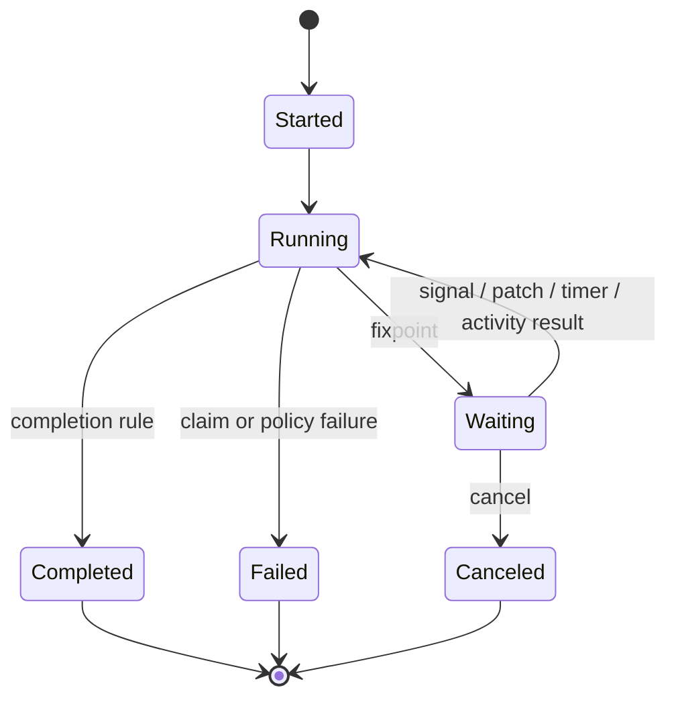
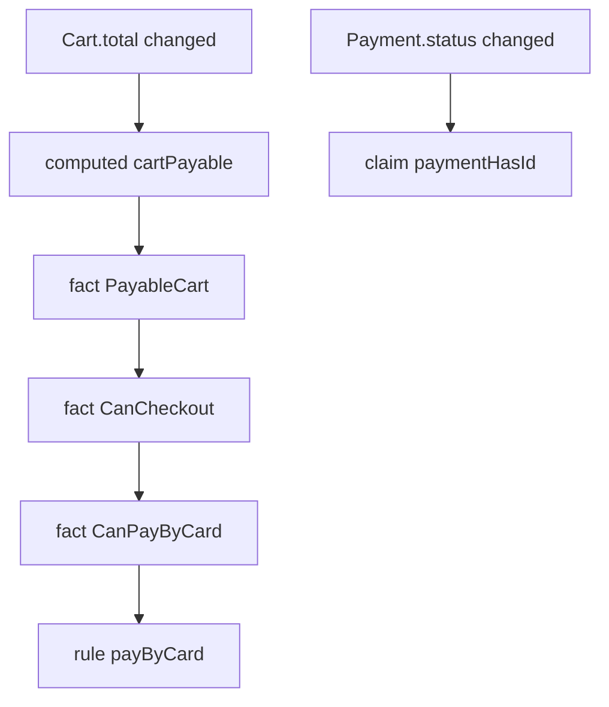

# Axiom CRFG

> [!summary]
> **Axiom CRFG** - это контекстно-реактивная модель исполнения для Axiom DSL. Она описывает не набор бизнес-состояний, а граф зависимостей: `context -> computed -> facts -> rules -> activities -> writes -> context`, защищенный `policies`, `claims`, `history` и `replay`.

Связанные документы: [[axiom_go_dsl_engine_temporal_like_library]] · [[Axiom File Specification]] · [[Axiom Studio UX]]

---

## 1. Зачем нужна эта модель

Классическая FSM спрашивает:

```text
В каком состоянии находится процесс и по какому переходу идти дальше?
```

Axiom CRFG спрашивает иначе:

```text
Какие данные сейчас есть?
Какие факты истинны?
Какие правила стали runnable?
Какие активности допустимо выполнить?
Какие writes безопасно применить?
Что будет записано в history?
```

Главная идея: не превращать комбинации условий в длинные имена состояний. Условия остаются независимыми данными, а поведение выводится из декларативного графа.

> [!abstract]
> Axiom не просит разработчика писать произвольный workflow-код. Разработчик описывает модель, а runtime строит детерминированные решения, сохраняет историю, запускает внешние эффекты через `activity` и продолжает после сбоя.

---

## 2. Канонические сущности

| Сущность | Назначение | Детерминизм | Где живет эффект |
|---|---|---:|---|
| `domain` | имя модели исполнения | да | нет эффекта |
| `context` | durable typed state | да | через `rule.write` |
| `signal` | внешний вход в execution | да, payload записывается | нет эффекта |
| `computed` | чистое производное значение | да | нет эффекта |
| `fact` | именованная истинность | да | нет эффекта |
| `activity` | зарегистрированная Go-работа | нет, но результат записывается | внутри activity |
| `rule` | триггер, условия, activity, writes | решение детерминированно | через activity и write |
| `policy` | retry, timeout, idempotency, concurrency | да | ограничивает эффект |
| `claim` | инвариант модели | да | блокирует опасный write |
| `query` | read-only projection | да | нет эффекта |
| `history` | append-only журнал решений | запись фактов исполнения | хранит результат |

> [!tip]
> Минимальное ядро Axiom: `context`, `signal`, `computed`, `fact`, `activity`, `rule`, `policy`, `claim`. Остальное должно расширять это ядро, а не заменять его.

### 2.1. Словарь после редакторского перехода

| Legacy-слово | Новое слово | Почему |
|---|---|---|
| `event` | `signal` | вход в execution должен звучать как Temporal signal, а не как абстрактное событие UI или логов |
| `derive` | `computed` | лучше показывает чистое вычисляемое значение |
| `func` | `activity` | внешний эффект должен быть явной runtime-активностью, совместимой с Temporal-like mental model |
| `capability` | чаще `fact` | возможность обычно выражается именованным фактом, например `CanPayByCard` |
| `goal` | чаще `query`, `claim` или future planner | v0 должен быть проще: правила приводят execution к fixpoint без отдельного planner-слоя целей |

> [!warning]
> Legacy-термины можно упоминать только при миграции старой документации или при сравнении моделей. В актуальном DSL v0 основными словами считаются `signal`, `computed`, `activity`, `fact`, `rule`, `policy`, `claim`.

---

## 3. Runtime pipeline

```mermaid
flowchart LR
  Signal["signal / patch / activity result"] --> Lock["lock execution"]
  Lock --> Context["context snapshot"]
  Context --> Computed["computed values"]
  Computed --> Facts["facts"]
  Facts --> Rules["runnable rules"]
  Rules --> ClaimsBefore["claims before write"]
  ClaimsBefore --> Decision["append decision to history"]
  Decision --> Activity{"has activity?"}
  Activity -- yes --> Task["schedule activity task"]
  Task --> Worker["worker executes Go activity"]
  Worker --> Result["activity result recorded"]
  Result --> Writes["apply rule.write"]
  Activity -- no --> Writes
  Writes --> ClaimsAfter["claims after write"]
  ClaimsAfter --> Fixpoint{"fixpoint?"}
  Fixpoint -- no --> Computed
  Fixpoint -- yes --> Waiting["waiting / completed"]
```



Компактная формула:

```text
Input -> Context -> Computed -> Facts -> Rules -> Activities -> Writes -> Context
```

Durability-формула:

```text
Decision -> Append history -> Execute activity -> Append result -> Apply write -> Continue
```

---

## 4. Execution lifecycle

`Execution` - одна durable instance домена.

| Статус | Значение | Что может вывести из статуса |
|---|---|---|
| `Started` | execution создан и получил initial context | первый signal или patch |
| `Running` | runtime применяет вход, пересчитывает graph или планирует activity | fixpoint, failure, cancellation |
| `Waiting` | runtime достиг fixpoint и ждет signal, timer или activity result | новый input |
| `Completed` | модель достигла прикладного завершения | только query/replay |
| `Failed` | claim, policy или unrecoverable error остановили execution | manual repair/retry |
| `Canceled` | execution отменен извне | query/history |



> [!tip]
> Эти статусы принадлежат runtime, а не бизнес-модели. Бизнес-состояния остаются в `context`, например `Payment.status`, `Inventory.status`, `Risk.status`.

---

## 5. History и replay

History - append-only журнал, из которого можно восстановить execution.

Типичные записи:

```text
ExecutionStarted
SignalReceived
ContextPatched
ComputedChanged
FactChanged
RuleScheduled
ActivityScheduled
ActivityStarted
ActivityCompleted
ActivityFailed
ActivityRetried
ActivityTimedOut
WriteApplied
ClaimChecked
ExecutionReachedFixpoint
ExecutionFailed
```

> [!danger]
> Replay никогда не должен повторно выполнять уже завершенную `activity`. Runtime читает recorded result из history, применяет recorded writes и продолжает только с незавершенной точки.

### 5.1. Что дает history

| Возможность | Как используется |
|---|---|
| Crash recovery | восстановить context, pending tasks и timers |
| Explainability | показать, почему rule была запущена или заблокирована |
| Idempotency | не повторять критичные внешние эффекты |
| Audit | доказать порядок signal, decisions, writes |
| Testability | сравнить golden trace |
| Manual repair | понять точку, с которой можно безопасно продолжить |

---

## 6. Context, computed и facts

`context` хранит durable state. `computed` вычисляет чистые значения. `fact` дает имя важной истинности и может раскрывать values через `expose`.

> [!example]
> Минимальный welcome flow без процедурного workflow-кода.

```axiom
domain Welcome

signal UserRegistered:
  userId: String
  email: String

context User:
  id: String?
  email: String?
  welcomeSent: Bool = false

computed userReady: Bool =
  User.id exists and User.email exists

fact RegisteredUser when:
  userReady
expose:
  id = User.id
  email = User.email

policy emailPolicy:
  retry: 2
  timeout: 5s
  concurrency: once
  idempotency: required

activity SendWelcomeEmail:
  require:
    RegisteredUser
  input:
    userId = RegisteredUser.id
    email = RegisteredUser.email
  output:
    sent: Bool
  effect: external
  idempotencyKey: RegisteredUser.id
  policy: emailPolicy

rule captureRegistration:
  on UserRegistered
  write:
    User.id = signal.userId
    User.email = signal.email

rule sendWelcomeEmail:
  on changed(User.email)
  when:
    User.welcomeSent == false
  require:
    RegisteredUser
  run: SendWelcomeEmail
  write:
    User.welcomeSent = output.sent

claim welcomeSentRequiresEmail:
  always:
    User.welcomeSent == true implies User.email exists
```

### 6.1. Почему это не FSM

FSM попыталась бы описать состояния вроде:

```text
Anonymous
RegisteredWithoutEmail
RegisteredWithEmail
WelcomeEmailSent
```

CRFG оставляет причины отдельно:

```text
User.id exists
User.email exists
User.welcomeSent == false
RegisteredUser
signal UserRegistered
```

Правило становится runnable, когда изменился нужный вход и facts стали истинны.

---

## 7. Rules и activities

`rule` координирует. `activity` делает внешнюю работу. `policy` ограничивает, как именно ее можно делать.

```axiom
activity ChargeCard:
  require:
    CanPayByCard
  input:
    userId = User.id
    amount = Cart.total
    token = CardPayment.token
  output:
    paymentId: String
    status: String
  effect: external
  idempotencyKey: Payment.intentId
  policy: paymentCritical

rule payByCard:
  on CheckoutConfirmed
  when:
    Payment.status != "paid"
  require:
    CanPayByCard
  run: ChargeCard
  write:
    Payment.id = output.paymentId
    Payment.status = output.status
    Payment.paidCount = Payment.paidCount + 1
```

> [!summary]
> Правило должно быть тонким: trigger, local condition, requirements, activity, writes. Сложная логика должна жить в `computed`, `fact`, `policy` или самой Go-activity.

---

## 8. Indexed delta engine

Runtime не должен сканировать всю модель после каждого signal. На compile-time строятся индексы:

| Индекс | Ключ | Значение |
|---|---|---|
| `contextFieldIndex` | `Cart.total` | computed/facts/rules/claims, зависящие от поля |
| `computedIndex` | `cartPayable` | facts/rules, читающие computed |
| `factIndex` | `PayableCart` | activities/rules/claims, требующие fact |
| `signalIndex` | `CheckoutRequested` | rules, подписанные на signal |
| `writeTargetIndex` | `Payment.status` | invalidation set после write |
| `claimIndex` | `Payment.paidCount` | claims, которые нужно проверить |



Контракт сложности:

```text
index lookup: average O(1)
delta propagation: O(k), где k - число реально затронутых nodes
activity execution: зависит от внешней системы
```

> [!warning]
> Axiom не обещает универсальное O(1). Если одно поле влияет на тысячу правил, runtime обязан обработать тысячу зависимостей. Цель - избежать глобальных сканов и пересчитывать только affected closure.

---

## 9. Fixpoint и ожидание

Fixpoint достигнут, если:

```text
нет новых context deltas
нет changed computed/facts
нет runnable rules без pending activity
нет due timers
все claims истинны
все policy gates закрыты корректно
```

Fixpoint не означает, что бизнес-процесс завершен. Это означает, что runtime больше не должен сам запускать работу без нового input.

> [!example]
> Waiting for signal без `await`.

```axiom
rule requestPayment:
  on CheckoutRequested
  require:
    CanCheckout
  run: SendPaymentLink
  write:
    Payment.status = "waiting"

rule payWhenConfirmed:
  on CheckoutConfirmed
  when:
    Payment.status == "waiting"
  require:
    CanPayByCard
  run: ChargeCard
  write:
    Payment.id = output.paymentId
    Payment.status = output.status
```

После `requestPayment` execution достигает fixpoint и ждет `CheckoutConfirmed`.

---

## 10. Timers

Durable timer - это persisted input, который должен переживать restart.

```axiom
activity SendPaymentReminder:
  require:
    PaymentWaiting
  input:
    userId = User.id
    orderId = Order.id
  output:
    sent: Bool
  effect: external
  idempotencyKey: hash(Order.id, "payment-reminder")
  policy: emailPolicy

rule sendPaymentReminder:
  on timer(24h after Order.createdAt)
  when:
    Payment.status == "waiting"
  require:
    PaymentWaiting
  run: SendPaymentReminder
  write:
    Payment.reminderSent = output.sent
```

Runtime representation:

```text
timer persisted as due task
worker polls due timers
due timer emits internal signal
rules react through the same indexed pipeline
```

---

## 11. Policies и failure paths

Policy отвечает на вопрос "как исполнять", а не "что исполнять".

| Field | Meaning | Typical values |
|---|---|---|
| `retry` | число повторов | `0`, `2`, `5` |
| `backoff` | стратегия задержки | `fixed(1s)`, `exponential(200ms, 5s)` |
| `timeout` | deadline попытки | `3s`, `10s`, `2m` |
| `concurrency` | поведение при дублях | `latest`, `first`, `once`, `parallel` |
| `idempotency` | требование ключа | `required`, `optional`, `none` |
| `audit` | требование audit trail | `required`, `optional`, `none` |
| `catch` | перевод ошибки в signal | `PaymentDeclined -> PaymentDeclinedReceived` |
| `compensation` | компенсирующая activity | `RefundPayment` |

```axiom
policy paymentCritical:
  retry: 0
  timeout: 10s
  concurrency: once
  idempotency: required
  audit: required
  catch:
    PaymentDeclined -> PaymentDeclinedReceived
    Timeout -> PaymentStatusUnknown
  compensation: RefundPayment
```

> [!danger]
> Критичная внешняя activity без `idempotencyKey` и подходящей policy должна отклоняться валидатором. Это защита от двойного платежа, повторной отправки shipment или дублирующего invoice.

---

## 12. Claims

`claim` - first-class invariant. Он проверяется после deltas, перед dangerous writes, после writes и во время replay.

```axiom
claim paymentHasId:
  always:
    Payment.status == "paid" implies Payment.id exists

claim noDoublePayment:
  always:
    Payment.paidCount <= 1
```

Claims должны быть пригодны для тестов:

```text
given initial context
when signals arrive
then all claims remain true
```

---

## 13. Explainability

Каждое решение должно отвечать на два вопроса:

```text
Why did this run?
Why did this not run?
```

Пример positive explanation:

```text
payByCard ran:
- signal CheckoutConfirmed was received
- when Payment.status != "paid" passed
- require CanPayByCard passed
- policy paymentCritical allowed scheduling
- claim noDoublePayment remained true before scheduling
- activity ChargeCard completed
- writes updated Payment.id, Payment.status, Payment.paidCount
```

Пример why-not:

```text
payByCard did not run:
- signal CheckoutConfirmed was received
- when Payment.status != "paid" passed
- require CanPayByCard failed
- CanPayByCard failed because RiskApproved is false
- RiskApproved is false because Risk.status = "unknown"
```

> [!tip]
> Explainability должна быть построена из тех же dependency indexes, history entries и claim checks, которые использует runtime. Отдельная "красивая" диагностика быстро начинает врать.

---

## 14. Queries

`query` - read-only projection над execution.

```axiom
query CheckoutStatus:
  return:
    ready = CanCheckout
    payment = Payment.status
    inventory = Inventory.status
    risk = Risk.status
    pending = runtime.pendingActivities
```

Built-in queries:

| Query | Возвращает |
|---|---|
| `state` | текущий context snapshot |
| `history` | append-only history |
| `trace` | человекочитаемый execution trace |
| `facts` | current fact values |
| `rules` | runnable/blocked rule status |
| `pendingActivities` | activity tasks в очереди |
| `claims` | claim status |

---

## 15. Checkout как сквозной пример

```axiom
domain Checkout

signal CheckoutRequested
signal CheckoutConfirmed

context User:
  id: String?
  country: String?

context Cart:
  items: List<String> = []
  total: Float = 0

context Inventory:
  status: String = "unknown"
  unavailable: List<String> = []

context Risk:
  status: String = "unknown"
  score: Float?

context Payment:
  method: Object?
  status: String = "idle"
  id: String?
  paidCount: Int = 0
  intentId: String?

computed cartPayable: Bool =
  Cart.items.length > 0 and Cart.total > 0

fact AuthenticatedUser when:
  User.id exists

fact PayableCart when:
  cartPayable
expose:
  items = Cart.items
  total = Cart.total

fact InventoryAvailable when:
  Inventory.status == "available"

fact RiskApproved when:
  Risk.status == "ok"

fact CardPayment when:
  Payment.method.kind == "card"
expose:
  token = Payment.method.token

fact CanCheckout when:
  AuthenticatedUser
  PayableCart
  InventoryAvailable
  RiskApproved

fact CanPayByCard when:
  CanCheckout
  CardPayment

policy externalCall:
  retry: 2
  backoff: exponential(200ms, 5s)
  timeout: 3s
  concurrency: latest
  idempotency: required

policy paymentCritical:
  retry: 0
  timeout: 10s
  concurrency: once
  idempotency: required
  audit: required

activity CheckInventory:
  require:
    AuthenticatedUser
    PayableCart
  input:
    items = PayableCart.items
    country = User.country
  output:
    status: String
    unavailable: List<String>
  effect: external
  idempotencyKey: hash(User.id, Cart.items, User.country)
  policy: externalCall

activity CalculateRisk:
  require:
    AuthenticatedUser
    PayableCart
  input:
    userId = User.id
    amount = Cart.total
    country = User.country
  output:
    status: String
    score: Float
  effect: external
  idempotencyKey: hash(User.id, Cart.total, User.country)
  policy: externalCall

activity ChargeCard:
  require:
    CanPayByCard
  input:
    userId = User.id
    amount = Cart.total
    token = CardPayment.token
  output:
    paymentId: String
    status: String
  effect: external
  idempotencyKey: Payment.intentId
  policy: paymentCritical

rule prepareInventory:
  on:
    CheckoutRequested
    changed(Cart.items)
    changed(User.country)
  when:
    Inventory.status in ["unknown", "expired"]
  run: CheckInventory
  write:
    Inventory.status = output.status
    Inventory.unavailable = output.unavailable

rule prepareRisk:
  on:
    CheckoutRequested
    changed(Cart.total)
    changed(User.id)
  when:
    Risk.status in ["unknown", "expired"]
  run: CalculateRisk
  write:
    Risk.status = output.status
    Risk.score = output.score

rule payByCard:
  on CheckoutConfirmed
  when:
    Payment.status != "paid"
  require:
    CanPayByCard
  run: ChargeCard
  write:
    Payment.id = output.paymentId
    Payment.status = output.status
    Payment.paidCount = Payment.paidCount + 1

claim paymentHasId:
  always:
    Payment.status == "paid" implies Payment.id exists

claim noDoublePayment:
  always:
    Payment.paidCount <= 1
```

---

## 16. Design rules

1. `context` должен быть нормализованным и иметь понятного владельца данных.
2. `computed` и `fact` всегда чистые.
3. Внешние эффекты допустимы только в `activity`.
4. Каждая external `activity` должна иметь policy, а критичная external activity - idempotency key.
5. `rule` не должна прятать бизнес-алгоритм; она связывает trigger, condition, activity и writes.
6. `claim` должен защищать инвариант, который страшно нарушить.
7. Runtime decisions должны писаться в history до внешнего эффекта или вместе с recorded result.
8. Replay не должен вызывать внешнюю систему повторно.
9. Explainability должна быть доступна для каждого runnable и blocked rule.
10. Простота DSL важнее теоретической полноты.

---

## 17. One-page summary

```text
Axiom CRFG

Input:
  signals, context patches, timers, activity results

State:
  typed durable context

Derivation:
  computed values and facts

Coordination:
  rules

Work:
  activities implemented in Go

Safety:
  policies and claims

Durability:
  append-only history and persisted activity tasks

Recovery:
  replay history, never re-run completed activities

Visibility:
  trace, query, explain
```

> [!summary]
> Axiom CRFG заменяет взрывающийся конечный автомат на самостабилизирующийся граф решений: данные меняются, facts пересчитываются, rules становятся runnable, activities выполняются под policies, writes проверяются claims, а history делает процесс восстанавливаемым.
