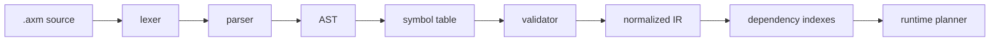

# Axiom File Specification

> [!summary]
> Этот документ задает файловую спецификацию Axiom DSL для `.axm`: синтаксис деклараций, выражения, normalized IR, валидацию и совместимость. Канонический runtime-смысл описан в [[axiom_go_dsl_engine_temporal_like_library]], концептуальная модель - в [[Axiom CRFG]], UX-проекция - в [[Axiom Studio UX]].

---

## 1. Scope

Axiom DSL описывает durable execution model:

```text
signals + context patches + activity results
  -> computed values
  -> facts
  -> runnable rules
  -> activities
  -> explicit writes
  -> claims
  -> history
```

Файл языка имеет расширение:

```text
.axm
```

> [!tip]
> Старое расширение `.axiom` можно поддерживать как import-compatibility alias, но новая документация и примеры должны использовать `.axm`.

---

## 2. File model

### 2.1. Canonical order

Парсер может принимать декларации в любом порядке, но formatter и документация используют такой порядок:

```text
domain
import
signal
context
computed
fact
policy
activity
rule
claim
query
```

### 2.2. Module rules

| Rule | Requirement |
|---|---|
| Domain | один `.axm` файл объявляет ровно один `domain` |
| Imports | внешние modules подключаются через `import` |
| Indentation | канонический отступ - два пробела |
| Tabs | запрещены |
| Comments | line comments через `#` |
| Encoding | UTF-8 |
| Parse strategy | сначала AST, затем symbol table, затем validation, затем IR |

```axiom
domain Checkout

import Common.Types
import Payments.Core as Payments

# line comment
```

> [!warning]
> Область `axiom-studio` не является частью этой файловой спецификации. Studio может редактировать DSL, но source of truth остается `.axm`.

---

## 3. Lexical grammar

### 3.1. Identifiers

```ebnf
Identifier      = Letter, { Letter | Digit | "_" } ;
QualifiedName   = Identifier, { ".", Identifier } ;
```

| Kind | Style | Examples |
|---|---|---|
| `domain` | PascalCase | `Checkout`, `Welcome` |
| `context` | PascalCase | `User`, `Payment` |
| `context field` | lowerCamelCase | `paidCount`, `createdAt` |
| `computed` | lowerCamelCase or lower.dot.case | `cartPayable`, `payment.waiting` |
| `fact` | PascalCase | `PayableCart`, `CanPayByCard` |
| `policy` | lowerCamelCase | `externalCall`, `paymentCritical` |
| `activity` | PascalCase | `ChargeCard`, `SendWelcomeEmail` |
| `rule` | lowerCamelCase | `payByCard`, `sendWelcomeEmail` |
| `claim` | lowerCamelCase | `noDoublePayment` |
| `query` | PascalCase | `CheckoutStatus` |

### 3.2. Literals

```ebnf
Literal =
    StringLiteral
  | FloatLiteral
  | IntLiteral
  | BoolLiteral
  | NullLiteral
  | DurationLiteral
  | ListLiteral
  | MapLiteral ;

StringLiteral   = '"', { Character }, '"' ;
IntLiteral      = Digit, { Digit } ;
FloatLiteral    = Digit, { Digit }, ".", Digit, { Digit } ;
BoolLiteral     = "true" | "false" ;
NullLiteral     = "null" ;
DurationLiteral = IntLiteral, ( "ms" | "s" | "m" | "h" ) ;
ListLiteral     = "[", [ Expression, { ",", Expression } ], "]" ;
MapLiteral      = "{", [ Identifier, ":", Expression, { ",", Identifier, ":", Expression } ], "}" ;
PolicyAtom      = "latest" | "first" | "once" | "parallel"
                | "required" | "optional" | "none" ;
```

```axiom
"guest"
42
3.14
true
null
250ms
3s
["unknown", "expired"]
{ kind: "card", trusted: true }
```

### 3.3. Types

```ebnf
TypeRef      = QualifiedName, [ "?" ] | GenericType, [ "?" ] ;
GenericType = Identifier, "<", TypeRef, { ",", TypeRef }, ">" ;
```

| Type | Meaning |
|---|---|
| `String` | text |
| `Int` | integer |
| `Float` | floating point |
| `Bool` | boolean |
| `Time` | timestamp |
| `Duration` | duration |
| `Object` | typed JSON-like object |
| `List<T>` | ordered list |
| `Map<K,V>` | key-value map |
| `T?` | nullable value |

---

## 4. Expressions

Axiom expressions чистые: они не читают clock, не вызывают network, не пишут в context и не запускают activity.

```ebnf
Expression =
    OrExpression ;

OrExpression =
    AndExpression, { "or", AndExpression } ;

AndExpression =
    CompareExpression, { "and", CompareExpression } ;

CompareExpression =
    AddExpression,
    [ ( "==" | "!=" | ">" | ">=" | "<" | "<=" | "in" | "implies" ), AddExpression ] ;

AddExpression =
    PrimaryExpression, { ( "+" | "-" ), PrimaryExpression } ;

PrimaryExpression =
    Literal
  | PolicyAtom
  | QualifiedName
  | QualifiedName, "exists"
  | "missing", "(", QualifiedName, ")"
  | "changed", "(", QualifiedName, ")"
  | "timer", "(", TimerExpression, ")"
  | PureCall
  | "(", Expression, ")" ;

TimerExpression =
    DurationLiteral, "after", QualifiedName ;

PureCall =
  ( "hash" | "fixed" | "exponential" ),
  "(", [ Expression, { ",", Expression } ], ")" ;

ConditionBlock =
  Expression, Newline, { Expression, Newline } ;
```

Канонические формы:

```axiom
User.id exists
Payment.method exists
missing(Payment.method)
changed(Cart.items)
timer(24h after Order.createdAt)
Risk.status in ["unknown", "expired"]
Payment.status == "paid" implies Payment.id exists
hash(User.id, Cart.items, User.country)
```

| Expression | Allowed in |
|---|---|
| `changed(...)` | только `rule.on` |
| `timer(...)` | только `rule.on` |
| `signal.*` | только rule, вызванная соответствующим signal |
| `output.*` | только `rule.write` после `run` |
| `runtime.*` | только `query.return`, если runtime projection разрешен |

Многострочный `ConditionBlock` трактуется как `and` между строками:

```axiom
fact CanCheckout when:
  AuthenticatedUser
  PayableCart
  InventoryAvailable
  RiskApproved
```

---

## 5. Declarations

### 5.1. Domain

```axiom
domain Checkout
```

```ebnf
DomainDecl = "domain", Identifier, Newline ;
```

Rules:

```text
one domain per file
domain name must be PascalCase
domain name is the root namespace
```

### 5.2. Import

```axiom
import Common.Types
import Payments.Core as Payments
```

```ebnf
ImportDecl = "import", QualifiedName, [ "as", Identifier ], Newline ;
```

Rules:

```text
alias required when imported symbols would collide
imports are resolved before validation
cyclic imports are invalid
```

### 5.3. Signal

```axiom
signal CheckoutRequested

signal PaymentAuthorized:
  paymentId: String
  amount: Float
```

```ebnf
SignalDecl =
  "signal", Identifier,
  [ ":", Newline, Indent, FieldDecl, { FieldDecl }, Dedent ],
  Newline ;
```

Signal payload is read as `signal.<field>` only while handling that signal.

### 5.4. Context

```axiom
context Payment:
  method: Object?
  status: String = "idle"
  id: String?
  paidCount: Int = 0
```

```ebnf
ContextDecl =
  "context", Identifier, ":", Newline,
  Indent, FieldDecl, { FieldDecl }, Dedent ;

FieldDecl =
  Identifier, ":", TypeRef, [ "=", Expression ], Newline ;
```

Validation rules:

```text
context field is the only direct write target
default value must match declared type
nullable field may omit default
non-nullable field without default must be present in initial context
```

### 5.5. Computed

```axiom
computed cartPayable: Bool =
  Cart.items.length > 0 and Cart.total > 0
```

```ebnf
ComputedDecl =
  "computed", QualifiedName, ":", TypeRef, "=", Newline,
  Indent, Expression, Dedent ;
```

Rules:

```text
computed is pure
computed cannot reference activity output
computed cannot reference runtime status
computed dependency cycles are invalid
```

### 5.6. Fact

```axiom
fact PayableCart when:
  cartPayable
expose:
  items = Cart.items
  total = Cart.total
```

```ebnf
FactDecl =
  "fact", Identifier, "when", ":", Newline,
  Indent, ConditionBlock, Dedent,
  [ ExposeBlock ] ;

ExposeBlock =
  "expose", ":", Newline,
  Indent, Binding, { Binding }, Dedent ;

Binding =
  Identifier, "=", Expression, Newline ;
```

Rules:

```text
fact is true only when expression evaluates to true
false or unknown makes fact unavailable
exposed values are readable as FactName.field
fact may depend on context, computed and other facts
cyclic fact dependency is invalid in v0
```

### 5.7. Policy

```axiom
policy paymentCritical:
  retry: 0
  timeout: 10s
  concurrency: once
  idempotency: required
  audit: required
  catch:
    PaymentDeclined -> PaymentDeclinedReceived
    Timeout -> PaymentStatusUnknown
  compensation: RefundPayment
```

```ebnf
PolicyDecl =
  "policy", Identifier, ":", Newline,
  Indent, PolicyEntry, { PolicyEntry }, Dedent ;

PolicyEntry =
    Identifier, ":", Expression, Newline
  | "catch", ":", Newline, Indent, CatchEntry, { CatchEntry }, Dedent ;

CatchEntry =
  Identifier, "->", Identifier, Newline ;
```

Standard fields:

| Field | Type | Required | Meaning |
|---|---|---:|---|
| `retry` | `Int` | yes | max retry attempts |
| `backoff` | expression | no | retry delay strategy |
| `timeout` | `Duration` | yes | per-attempt timeout |
| `heartbeat` | `Duration` | no | progress interval for long activity |
| `concurrency` | atom | yes | `latest`, `first`, `once`, `parallel` |
| `idempotency` | atom | yes for external | `required`, `optional`, `none` |
| `audit` | atom | no | `required`, `optional`, `none` |
| `catch` | map | no | error type to internal signal |
| `compensation` | activity ref | no | compensating activity |

### 5.8. Activity

```axiom
activity ChargeCard:
  require:
    CanPayByCard
  input:
    userId = User.id
    amount = Cart.total
    token = CardPayment.token
  output:
    paymentId: String
    status: String
  effect: external
  idempotencyKey: Payment.intentId
  policy: paymentCritical
```

```ebnf
ActivityDecl =
  "activity", Identifier, ":", Newline,
  Indent,
  [ RequireBlock ],
  InputBlock,
  OutputBlock,
  EffectField,
  [ IdempotencyKeyField ],
  PolicyRef,
  Dedent ;

RequireBlock =
  "require", ":", Newline, Indent, Requirement, { Requirement }, Dedent ;

Requirement =
  Expression, Newline ;

InputBlock =
  "input", ":", Newline, Indent, Binding, { Binding }, Dedent ;

OutputBlock =
  "output", ":", Newline, Indent, FieldDecl, { FieldDecl }, Dedent ;

EffectField =
  "effect", ":", ( "none" | "local" | "external" ), Newline ;

IdempotencyKeyField =
  "idempotencyKey", ":", Expression, Newline ;

PolicyRef =
  "policy", ":", Identifier, Newline ;
```

Effect values:

| Effect | Meaning | Runtime rule |
|---|---|---|
| `none` | pure local calculation | may run in process, result still recorded |
| `local` | local process side effect | result recorded, retry policy required |
| `external` | network/db/payment/email side effect | idempotency and timeout policy required |

Validation rules:

```text
activity never writes context directly
input bindings may read context, computed and facts
output fields define output.* available in rule.write
external activity requires policy
external activity with idempotency required must define idempotencyKey
```

### 5.9. Rule

```axiom
rule prepareRisk:
  on:
    CheckoutRequested
    changed(Cart.total)
    changed(User.id)
  when:
    Risk.status in ["unknown", "expired"]
  require:
    AuthenticatedUser
    PayableCart
  run: CalculateRisk
  write:
    Risk.status = output.status
    Risk.score = output.score
```

```ebnf
RuleDecl =
  "rule", Identifier, ":", Newline,
  Indent,
  RuleOnBlock,
  [ RuleWhenBlock ],
  [ RequireBlock ],
  [ RunField ],
  WriteBlock,
  Dedent ;

RuleOnBlock =
  "on", Trigger, Newline
  | "on", ":", Newline, Indent, Trigger, { Trigger }, Dedent ;

Trigger =
    Identifier
  | "changed", "(", QualifiedName, ")"
  | "timer", "(", TimerExpression, ")" ;

RuleWhenBlock =
  "when", ":", Newline, Indent, ConditionBlock, Dedent ;

RunField =
  "run", ":", Identifier, Newline ;

WriteBlock =
  "write", ":", Newline, Indent, WriteMapping, { WriteMapping }, Dedent ;

WriteMapping =
  QualifiedName, "=", Expression, Newline ;
```

Rules:

```text
rule.on defines triggers
rule.when is a local deterministic condition
rule.require must be true before scheduling activity
rule.run references at most one activity
rule without run is allowed only for deterministic context writes
write target must be a context field
output.* is allowed only when run is present
```

### 5.10. Claim

```axiom
claim noDoublePayment:
  always:
    Payment.paidCount <= 1
```

```ebnf
ClaimDecl =
  "claim", Identifier, ":", Newline,
  Indent, AlwaysBlock, Dedent ;

AlwaysBlock =
  "always", ":", Newline, Indent, ConditionBlock, Dedent ;
```

Claim checks:

```text
after context patch
before scheduling dangerous external activity when write impact is knowable
before applying writes
after applying writes
on replay
in tests
```

### 5.11. Query

```axiom
query CheckoutStatus:
  return:
    ready = CanCheckout
    payment = Payment.status
    inventory = Inventory.status
    risk = Risk.status
```

```ebnf
QueryDecl =
  "query", Identifier, ":", Newline,
  Indent, ReturnBlock, Dedent ;

ReturnBlock =
  "return", ":", Newline, Indent, Binding, { Binding }, Dedent ;
```

Rules:

```text
query is read-only
query may read context, computed, facts and whitelisted runtime projections
query cannot call activity
query cannot mutate context
```

---

## 6. Runtime semantics

### 6.1. Input algorithm

```pseudo
onInput(executionID, input):
  tx.begin
  execution := store.lockExecution(executionID)

  appendHistory(input)
  applyInputToContext(input)

  affected := indexes.lookup(input.changedFields, input.signalName)
  recomputeComputedAndFacts(affected)

  candidates := collectTriggeredRules(input, affected)

  for rule in candidates:
    if rule.when exists and !eval(rule.when): continue
    if !evalAll(rule.require): continue
    if !claimsAllow(rule): failOrBlock

    if rule.run exists:
      task := scheduleActivity(rule)
      appendHistory(ActivityScheduled(task))
    else:
      delta := evalWrite(rule.write)
      applyDelta(delta)
      appendHistory(WriteApplied(delta))

  checkClaims()
  appendHistory(ExecutionReachedFixpoint) if no immediate work
  store.save(execution)
  tx.commit
```

### 6.2. Worker algorithm

```pseudo
workerLoop():
  task := store.pollActivityTask(workerID)
  if task == nil: sleep

  result, err := executeRegisteredActivity(task)

  tx.begin
  execution := store.lockExecution(task.executionID)

  if err:
    decision := policy.onError(task, err)
    applyRetryCatchOrFailure(decision)
  else:
    markCompleted(task, result)
    appendHistory(ActivityCompleted)
    applyActivityOutputWrites(task.rule, result)
    appendHistory(WriteApplied)
    continueRuntimeUntilFixpoint()

  tx.commit
```

### 6.3. Minimal persistence shape

This SQL is illustrative. The store adapter owns final migrations.

```sql
CREATE TABLE executions (
  id TEXT PRIMARY KEY,
  domain TEXT NOT NULL,
  status TEXT NOT NULL,
  context_json TEXT NOT NULL,
  version INTEGER NOT NULL,
  created_at TIMESTAMP,
  updated_at TIMESTAMP
);

CREATE TABLE history_entries (
  id INTEGER PRIMARY KEY AUTOINCREMENT,
  execution_id TEXT NOT NULL,
  seq INTEGER NOT NULL,
  type TEXT NOT NULL,
  payload_json TEXT NOT NULL,
  created_at TIMESTAMP,
  UNIQUE(execution_id, seq)
);

CREATE TABLE activity_tasks (
  id TEXT PRIMARY KEY,
  execution_id TEXT NOT NULL,
  rule_name TEXT,
  activity_name TEXT NOT NULL,
  input_json TEXT NOT NULL,
  idempotency_key TEXT,
  status TEXT NOT NULL,
  attempt INTEGER NOT NULL,
  next_run_at TIMESTAMP,
  locked_by TEXT,
  locked_until TIMESTAMP,
  result_json TEXT,
  error_json TEXT,
  created_at TIMESTAMP,
  updated_at TIMESTAMP
);
```

---

## 7. Normalized IR

```text
ModuleIR
  domain: DomainName
  imports: ImportIR[]
  symbols: SymbolTable
  declarations:
    signals: SignalIR[]
    contexts: ContextIR[]
    computed: ComputedIR[]
    facts: FactIR[]
    policies: PolicyIR[]
    activities: ActivityIR[]
    rules: RuleIR[]
    claims: ClaimIR[]
    queries: QueryIR[]
  indexes: DependencyIndexes
```

### 7.1. Symbol

```text
Symbol
  name: QualifiedName
  kind: domain | import | signal | context | field | computed | fact | exposedField | policy | activity | rule | claim | query
  type: TypeRef
  owner: QualifiedName?
  sourceRange: SourceRange
```

### 7.2. Dependency indexes

```text
DependencyIndexes
  contextFieldIndex: Map<QualifiedName, NodeId[]>
  computedDependencyIndex: Map<QualifiedName, NodeId[]>
  factDependencyIndex: Map<QualifiedName, NodeId[]>
  signalIndex: Map<SignalName, RuleId[]>
  timerIndex: Map<TimerSpec, RuleId[]>
  writeTargetIndex: Map<QualifiedName, RuleId[]>
  policyIndex: Map<PolicyName, ActivityId[]>
  claimIndex: Map<QualifiedName, ClaimId[]>
```



---

## 8. Validation

Валидатор работает после parsing и symbol table.

### 8.1. Error codes

| Code | Severity | Meaning |
|---|---|---|
| `AX001` | error | unresolved reference |
| `AX002` | error | duplicate declaration |
| `AX003` | error | duplicate field |
| `AX004` | error | ambiguous import |
| `AX005` | error | reserved keyword used as identifier |
| `AX101` | error | default value type mismatch |
| `AX102` | error | expression type mismatch |
| `AX103` | error | nullable value used as non-null |
| `AX104` | error | output mapping type mismatch |
| `AX105` | error | invalid operator for operand type |
| `AX201` | error | cyclic computed dependency |
| `AX202` | error | cyclic fact dependency |
| `AX203` | error | `changed()` outside `rule.on` |
| `AX204` | error | `signal.*` outside signal-triggered rule |
| `AX205` | warning | broad dependency hurts incremental runtime |
| `AX301` | error | invalid write target |
| `AX302` | error | output field does not exist |
| `AX303` | error | `rule.run` references non-activity |
| `AX304` | error | unsafe external effect |
| `AX305` | error | idempotency key required but missing |
| `AX306` | error | catch target signal does not exist |
| `AX307` | error | claim may be violated by write mapping |
| `AX308` | error | non-convergent rule loop |
| `AX401` | warning | unused declaration |
| `AX402` | warning | fact never true under known constraints |
| `AX403` | warning | activity has no callers |
| `AX404` | warning | query has unresolved runtime projection |

### 8.2. Invalid unresolved reference

```axiom
domain InvalidReference

fact CanCheckout when:
  RiskApproved
```

Result:

```text
AX001 unresolved reference: RiskApproved
```

### 8.3. Invalid output mapping

```axiom
domain InvalidWrite

signal Requested

context Risk:
  requested: Bool = false
  status: String = "unknown"

fact Ready when:
  Risk.requested

policy local:
  retry: 0
  timeout: 1s
  concurrency: once
  idempotency: none

activity CalculateRisk:
  require:
    Ready
  input:
    requested = Risk.requested
  output:
    status: String
  effect: none
  policy: local

rule badWrite:
  on Requested
  require:
    Ready
  run: CalculateRisk
  write:
    Risk.status = output.unknownStatus
```

Result:

```text
AX302 output field does not exist: output.unknownStatus
```

### 8.4. Unsafe external activity

```axiom
domain UnsafePayment

context User:
  id: String?

fact AuthenticatedUser when:
  User.id exists

policy looseExternalCall:
  retry: 2
  timeout: 3s
  concurrency: latest
  idempotency: none

activity Pay:
  require:
    AuthenticatedUser
  input:
    userId = User.id
  output:
    status: String
  effect: external
  policy: looseExternalCall
```

Result:

```text
AX305 idempotency key required but missing
```

### 8.5. Invalid catch target

```axiom
domain InvalidCatch

policy paymentCritical:
  retry: 0
  timeout: 10s
  concurrency: once
  idempotency: required
  catch:
    PaymentDeclined -> PaymentDeclinedReceived
```

Result if `PaymentDeclinedReceived` is not declared:

```text
AX306 catch target signal does not exist: PaymentDeclinedReceived
```

### 8.6. Non-convergent rule loop

```axiom
domain NonConvergent

signal Start

context State:
  started: Bool = false
  n: Int = 0

fact LoopActive when:
  State.started

policy local:
  retry: 0
  timeout: 1s
  concurrency: once
  idempotency: none

activity Tick:
  require:
    LoopActive
  input:
    n = State.n
  output:
    ok: Bool
  effect: none
  policy: local

rule startLoop:
  on Start
  write:
    State.started = true
    State.n = State.n + 1

rule continueLoop:
  on changed(State.n)
  require:
    LoopActive
  run: Tick
  write:
    State.n = State.n + 1
```

Result:

```text
AX308 non-convergent rule loop
```

---

## 9. Valid examples

### 9.1. Minimal welcome flow

```axiom
domain Welcome

signal UserRegistered:
  userId: String
  email: String

context User:
  id: String?
  email: String?
  welcomeSent: Bool = false

computed userReady: Bool =
  User.id exists and User.email exists

fact RegisteredUser when:
  userReady
expose:
  id = User.id
  email = User.email

policy emailPolicy:
  retry: 2
  timeout: 5s
  concurrency: once
  idempotency: required

activity SendWelcomeEmail:
  require:
    RegisteredUser
  input:
    userId = RegisteredUser.id
    email = RegisteredUser.email
  output:
    sent: Bool
  effect: external
  idempotencyKey: RegisteredUser.id
  policy: emailPolicy

rule captureRegistration:
  on UserRegistered
  write:
    User.id = signal.userId
    User.email = signal.email

rule sendWelcomeEmail:
  on changed(User.email)
  when:
    User.welcomeSent == false
  require:
    RegisteredUser
  run: SendWelcomeEmail
  write:
    User.welcomeSent = output.sent

claim welcomeSentRequiresEmail:
  always:
    User.welcomeSent == true implies User.email exists
```

### 9.2. Payment failure with catch

```axiom
domain PaymentFlow

signal CheckoutConfirmed
signal PaymentDeclinedReceived
signal PaymentStatusUnknown

context Payment:
  status: String = "idle"
  id: String?
  intentId: String?
  declineReason: String?

fact PaymentReady when:
  Payment.intentId exists

policy paymentCritical:
  retry: 0
  timeout: 10s
  concurrency: once
  idempotency: required
  audit: required
  catch:
    PaymentDeclined -> PaymentDeclinedReceived
    Timeout -> PaymentStatusUnknown

activity ChargeCard:
  require:
    PaymentReady
  input:
    intentId = Payment.intentId
  output:
    paymentId: String
    status: String
  effect: external
  idempotencyKey: Payment.intentId
  policy: paymentCritical

rule pay:
  on CheckoutConfirmed
  when:
    Payment.status != "paid"
  require:
    PaymentReady
  run: ChargeCard
  write:
    Payment.id = output.paymentId
    Payment.status = output.status

rule markDeclined:
  on PaymentDeclinedReceived
  write:
    Payment.status = "declined"
    Payment.declineReason = "processor_declined"

rule markUnknown:
  on PaymentStatusUnknown
  write:
    Payment.status = "unknown"
```

### 9.3. Timer reminder

```axiom
domain Reminder

context Order:
  id: String
  createdAt: Time

context Payment:
  status: String = "waiting"
  reminderSent: Bool = false

fact PaymentWaiting when:
  Payment.status == "waiting"

policy emailPolicy:
  retry: 2
  timeout: 5s
  concurrency: once
  idempotency: required

activity SendPaymentReminder:
  require:
    PaymentWaiting
  input:
    orderId = Order.id
  output:
    sent: Bool
  effect: external
  idempotencyKey: hash(Order.id, "payment-reminder")
  policy: emailPolicy

rule sendPaymentReminder:
  on timer(24h after Order.createdAt)
  when:
    Payment.reminderSent == false
  require:
    PaymentWaiting
  run: SendPaymentReminder
  write:
    Payment.reminderSent = output.sent
```

### 9.4. Query and explain surface

```axiom
query CheckoutStatus:
  return:
    payment = Payment.status
    ready = CanCheckout
    pending = runtime.pendingActivities
```

Built-in explain target names:

```text
rule:<ruleName>
activity:<activityName>
fact:<factName>
claim:<claimName>
```

---

## 10. Compatibility rules

> [!warning]
> This section is the only place where legacy vocabulary is normative.

| Legacy | Compatibility handling |
|---|---|
| `event` | parser may suggest `signal`; formatter must emit `signal` |
| `derive` | parser may suggest `computed`; formatter must emit `computed` |
| `func` | parser may suggest `activity`; formatter must emit `activity` |
| `capability` | migrate to `fact` when it represents a boolean availability condition |
| `goal` | postpone to future planner layer; use `query` or `claim` when possible |

Forbidden in v0:

```text
inline policy inside rule
multiple activities in one rule.run
side effects in computed or fact
dynamic creation of context fields
implicit imports
tabs for indentation
hidden mutable globals
activity result reads outside rule.write/history replay
```

---

## 11. Acceptance checklist

- [ ] `.axm` parses to AST.
- [ ] Symbol table contains all declared names and exposed fields.
- [ ] Dependency indexes contain context, computed, fact, signal, timer, policy, write and claim edges.
- [ ] Validation catches unresolved names, invalid writes, unsafe external effects and non-convergent loops.
- [ ] Formatter emits canonical declaration order.
- [ ] Runtime can load normalized IR without scanning source text.
- [ ] Examples in this document remain synchronized with [[Axiom CRFG]].
