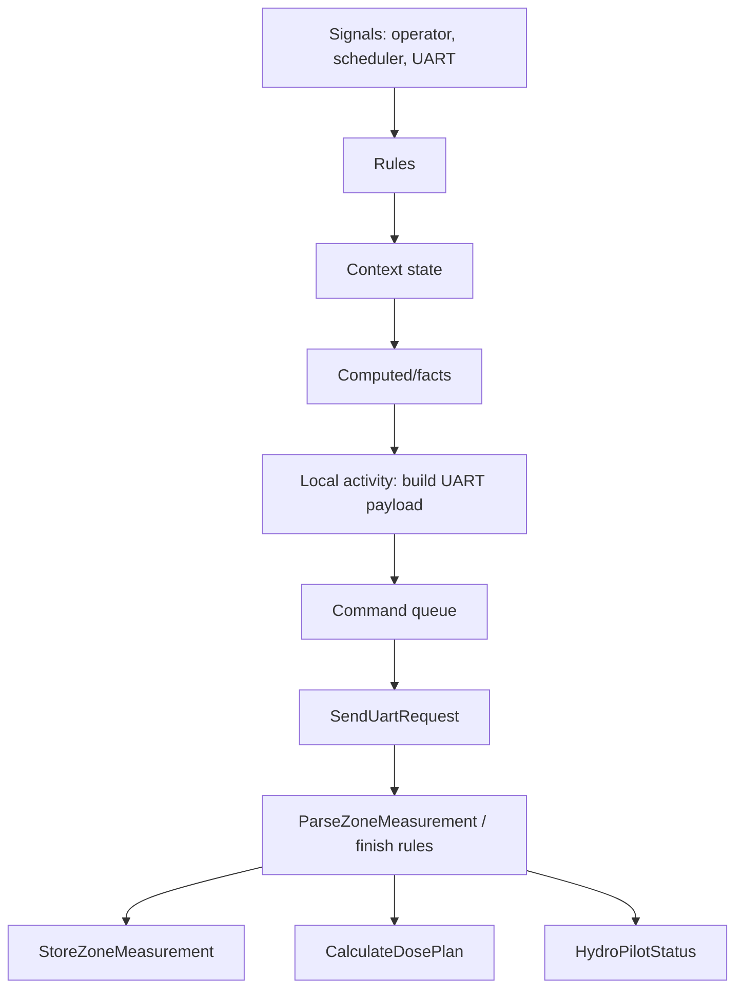
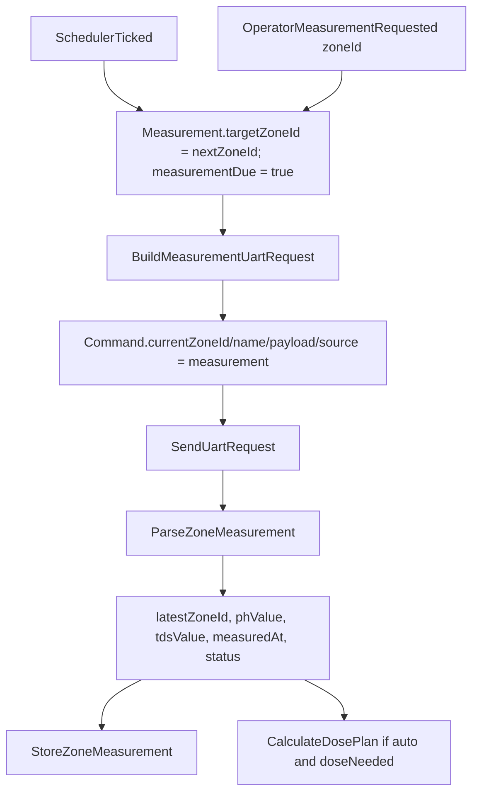
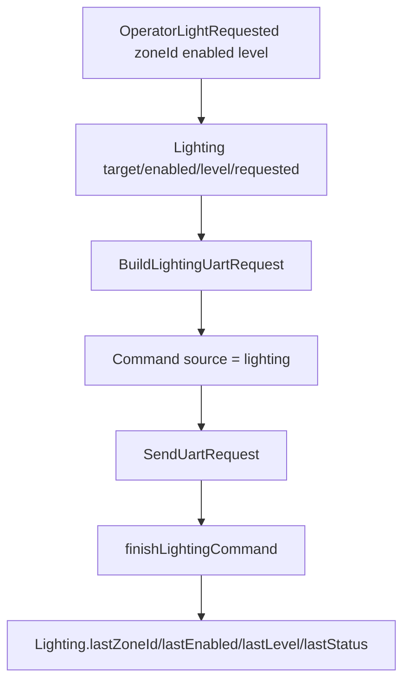

# HydroPilot AXM Documentation

> [!summary]
> `HydroPilot` - Axiom DSL-модель для четырёх зон измерений pH/TDS и четырёх зон освещения. Модель не дублирует `Zone1..Zone4`: все зонные операции параметризованы `zoneId`, а история измерений уходит во внешнюю БД через отдельную activity `StoreZoneMeasurement`.

## Быстрая сводка

| Показатель | Значение |
|---|---:|
| Domain | `HydroPilot` |
| Signals | `11` |
| Contexts | `9` |
| Computed | `21` |
| Facts | `9` |
| Policies | `5` |
| Activities | `9` |
| Rules | `37` |
| Claims | `6` |
| Queries | `1` |

## Архитектура



Главный принцип: зона является параметром операции, а не отдельным набором контекстов. Поэтому вместо `Zone1`, `Zone2`, `Zone3`, `Zone4` используются:

- `Measurement.targetZoneId` - зона, которую нужно измерить.
- `Measurement.latestZoneId` - зона последнего принятого измерения.
- `Measurement.nextZoneId` - round-robin указатель для плановых измерений `1..4`.
- `Lighting.targetZoneId` - зона света, к которой применится команда.
- `Command.currentZoneId` и `Command.lastZoneId` - зонная привязка UART-команды.

## Контексты

| Context | Назначение |
|---|---|
| `System` | Режим `manual/auto/service`, готовность, tick. |
| `Uart` | Готовность, подключение и circuit breaker UART. |
| `Command` | Единая очередь UART-команды с `currentZoneId`, `currentName`, `currentPayload`, `currentSource`. |
| `Safety` | Interlock и emergency-stop. |
| `Measurement` | Параметризованный слот измерений pH/TDS для 4 зон, без хранения четырёх копий. |
| `Dose` | План дозирования для последней принятой зоны. |
| `Lighting` | Intent и последний статус освещения для 4 зон. |
| `Operator` | Запросы режима, ручной команды, калибровки и уведомлений. |
| `Runtime` | Интеграционные флаги runtime/persistence/dashboard. |

## Сигналы

| Signal | Смысл |
|---|---|
| `SystemStarted` | Старт системы. |
| `SchedulerTicked` | Плановый tick, двигает round-robin измерений. |
| `OperatorModeRequested` | Запрос режима. |
| `OperatorMeasurementRequested` | Ручной запрос измерения зоны `1..4`. |
| `OperatorControlRequested` | Запрос контроля зоны `1..4`, начинается с измерения. |
| `OperatorLightRequested` | Команда освещения зоны `1..4`: `enabled`, `level`. |
| `OperatorCommandRequested` | Ручная UART-команда для зоны `1..4`. |
| `OperatorEstopRequested` | Включение emergency stop. |
| `OperatorEstopClearRequested` | Подтверждённое снятие emergency stop. |
| `CalibrationRequested` | Калибровка `ph` или `tds` для зоны `1..4`. |
| `UartCommandCompleted` | Результат UART-команды с `zoneId`, `name`, `status`, `errorCode`, `responseRaw`. |

## Измерения pH/TDS



`BuildMeasurementUartRequest` отвечает за правильное формирование UART-команды измерения. DSL передаёт `zoneId` и `tick`, а Go-реализация должна собрать протокольный `commandName` и `payload`.

`StoreZoneMeasurement` - отдельная external activity для записи измерений в БД. Она получает:

- `zoneId`
- `phValue`
- `tdsValue`
- `status`
- `measuredAt`
- `tick`

Idempotency key: `hash("measurement-db", Measurement.latestZoneId, Measurement.measuredAt)`.

## Освещение



Освещение поддерживает 4 зоны через `Lighting.targetZoneId in [1, 2, 3, 4]`. Payload не собирается в правилах, а формируется в `BuildLightingUartRequest`.

## UART-команды

Все команды сходятся в `Command` и отправляются через одну activity `SendUartRequest`.

| Source | Как формируется | Назначение |
|---|---|---|
| `measurement` | `BuildMeasurementUartRequest` | Чтение pH/TDS зоны. |
| `auto-dose` | `CalculateDosePlan` | Дозирование для последней принятой зоны. |
| `lighting` | `BuildLightingUartRequest` | Управление светом зоны. |
| `calibration` | `BuildCalibrationUartRequest` | Калибровка pH/TDS зоны. |
| `manual` | `OperatorCommandRequested` | Ручная команда оператора. |
| `safety` | Литералы `safety.estopOn/Off` | Emergency stop. |

> [!warning]
> Реальный формат UART-протокола должен быть реализован в Go-activity `BuildMeasurementUartRequest`, `BuildLightingUartRequest`, `BuildCalibrationUartRequest` и `CalculateDosePlan`. DSL гарантирует, что туда передаётся правильный `zoneId` и нужные параметры.

## Activities

| Activity | Effect | Назначение |
|---|---|---|
| `BuildMeasurementUartRequest` | `local` | Сформировать UART-команду измерения для зоны. |
| `ParseZoneMeasurement` | `local` | Распарсить UART-ответ в `phValue`, `tdsValue`, `measuredAt`. |
| `StoreZoneMeasurement` | `external` | Записать измерение в отдельную БД. |
| `CalculateDosePlan` | `local` | Рассчитать зонный план дозирования pH/TDS и UART payload. |
| `BuildLightingUartRequest` | `local` | Сформировать UART-команду освещения. |
| `BuildCalibrationUartRequest` | `local` | Сформировать UART-команду калибровки. |
| `SendUartRequest` | `external` | Единый UART-шлюз. |
| `StoreCalibration` | `local` | Сохранить результат калибровки. |
| `NotifyOperator` | `external` | Уведомить оператора. |

> [!warning]
> `hydro_pilot_activities.go` содержит заглушки `not implemented`. Контракт уже обновлён, но реальные UART/DB/calculation реализации нужно написать отдельно.

## Ключевые правила

| Группа | Rules |
|---|---|
| Захват событий | `captureSystemStarted`, `captureSchedulerTick`, `captureModeRequest`, `captureMeasurementRequest`, `captureControlRequest`, `captureLightRequest`, `captureManualCommand`, `captureCalibrationRequest`, `captureUartCompletion` |
| Измерения | `resetMeasurementRoundRobin`, `markMeasurementDueOnTick`, `queueMeasurementRead`, `parseMeasurementResult`, `markMeasurementFailed`, `storeMeasurementRecord` |
| Дозирование | `planAutomaticDose`, `skipControlWhenDoseNotNeeded`, `finishAutoDoseCommand` |
| Освещение | `queueLightingCommand`, `finishLightingCommand` |
| UART | `runQueuedUartCommand` |
| Safety | `captureEstopRequest`, `captureEstopClearRequest`, `queueEstopOn`, `queueEstopOff`, `finishSafetyCommand`, `unlockAfterSafeAck` |
| Manual/calibration | `queueManualCommand`, `finishManualCommand`, `queueCalibrationCommand`, `storePhCalibrationResult`, `storeTdsCalibrationResult` |
| Уведомления | `notifySafetyOnce`, `notifyCommandFailedOnce`, `notifyCalibrationExpiredOnce` |

## Инварианты

| Claim | Смысл |
|---|---|
| `safetyBlocksActuators` | Safety-блокировка запрещает `auto-dose`, `manual`, `lighting`. |
| `zoneIdsStayBounded` | Зонные target id остаются `0` или `1..4`. |
| `dosePlanHasPayloadAmountAndZone` | Готовый план дозы обязан иметь зону, payload и объём. |
| `measurementStoreRequiresLatestZone` | Запись измерения в БД требует валидную последнюю зону. |
| `commandResultIsRecorded` | Если есть последняя команда, должен быть статус. |
| `calibrationNotificationMirrorsState` | Уведомление о просроченной калибровке не может быть true без самой просрочки. |

## Query `HydroPilotStatus`

Query возвращает статус системы, UART, safety, текущего/последнего измерения, дозирования, освещения, ошибок и калибровки. Важные поля:

- `measurementZoneCount`, `measurementNextZoneId`, `measurementTargetZoneId`, `measurementLatestZoneId`
- `ph`, `tds`, `phLow`, `phHigh`, `tdsLow`, `tdsHigh`
- `measurementStoreDue`, `measurementRecordId`, `measurementAccepted`
- `dosePlanReady`, `dosePlanZoneId`, `dosePlanKind`, `dosePlanAmountMl`
- `lightingZoneCount`, `lightingTargetZoneId`, `lightingRequested`, `lightingLastZoneId`
- `commandZoneId`, `commandSource`, `commandLastZoneId`, `commandStatus`

## Проверка

```powershell
go run ./cmd/axiom validate examples/hydropilot/hydropilot.axm
go run ./tools/axiomgen --file examples/hydropilot/hydropilot.axm
go test ./...
```

Ожидаемая сводка валидатора:

```json
{
  "activities": 9,
  "claims": 6,
  "computed": 21,
  "contexts": 9,
  "domain": "HydroPilot",
  "facts": 9,
  "queries": 1,
  "rules": 37,
  "signals": 11
}
```
