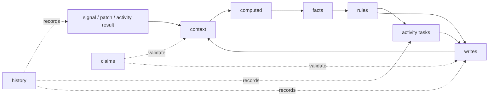
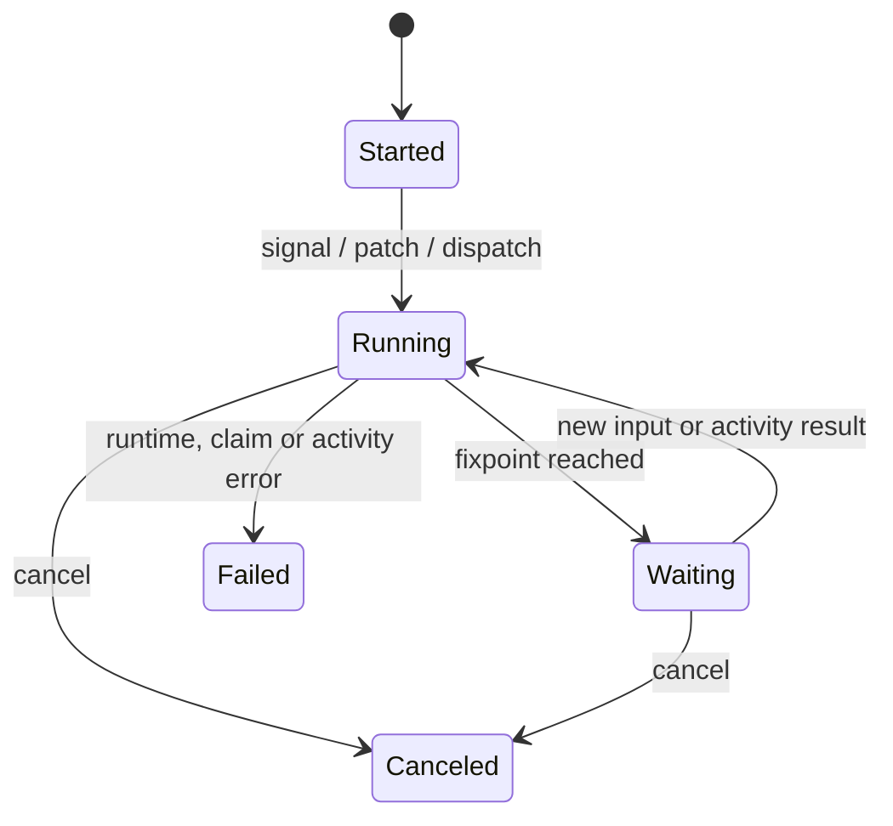

# Axiom CRFG

Axiom CRFG (Context Reactive Graph) — концептуальное описание compiled runtime: состояние и входные данные образуют граф зависимостей, который определяет вычисляемые значения, facts, rules, activities и writes.

Точный архитектурный контракт описан в [`../ARCHITECTURE.md`](../ARCHITECTURE.md), а фактические гарантии и ограничения runtime — в [`runtime-semantics.md`](runtime-semantics.md).

## Модель зависимостей

Ключевая идея: бизнес-состояния остаются данными в `context`, а не превращаются в единую громоздкую FSM. Rules реагируют на `signal`, `changed(...)` и timer triggers, проверяют условия и claims, планируют activity либо применяют writes.

## Канонические сущности

| Сущность | Назначение |
|---|---|
| `domain` | Имя модели |
| `context` | Сохраняемое состояние |
| `signal` | Внешний вход compiled runtime |
| `computed` | Чистое производное значение |
| `fact` | Именованное условие с optional exposed values |
| `rule` | Trigger, guards, activity и/или writes |
| `activity` | Зарегистрированная Go-операция, выполняемая через task |
| `policy` | Конфигурация activity; часть полей пока поддерживается не полностью |
| `claim` | Инвариант, блокирующий недопустимый write |
| `query` | Read-only projection |
| `history` | Журнал execution для аудита и replay |

## Execution lifecycle

`StatusCompleted` существует в runtime types, но автоматический переход в него в проверенном execution path не подтверждён. Поэтому CRFG не определяет completion rule как текущую runtime guarantee.

## History и replay

Подтверждённые основные history entries включают:

- `ExecutionStarted`;
- `ContextPatched`;
- `SignalReceived`;
- `RulesEvaluated` либо `RuleScheduled`/`RuleSkipped` в зависимости от trace level;
- `ActivityScheduled`, `ActivityDeduplicated`, `ActivityCompleted`, `ActivityFailed`;
- `WriteApplied`;
- `ExecutionReachedFixpoint`;
- `ExecutionCanceled`.

Replay сверяет module hash и восстанавливает состояние из записанной истории. Завершённые activity повторно не вызываются.

## Важные границы

- `retry`, `timeout` и `concurrency` разбираются моделью, но не являются полностью реализованными runtime guarantees.
- Idempotency дедуплицирует task в store, но не обеспечивает exactly-once во внешней системе.
- Блокировка execution действует внутри одного `Engine`; распределённое владение обеспечивает приложение.
- Typed Go Flow использует другую модель `load -> reducer -> claims -> effects -> save` и не является compiled CRFG runtime.

Практический пример AXM: [`../examples/axiom-files/welcome.axm`](../examples/axiom-files/welcome.axm).
