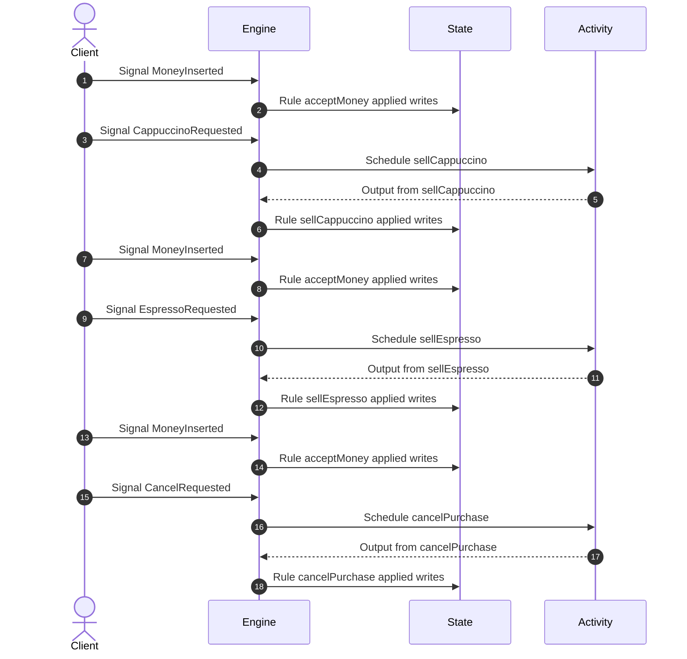
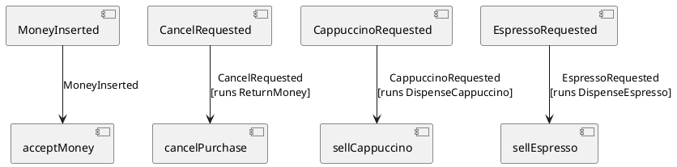

# Coffee Machine Process Diagrams

## 1. Flowchart Diagram (Mermaid)

```mermaid
flowchart TD
  subgraph Signals [Triggers & Events]
    sig_CancelRequested(["⚡ CancelRequested"])
    sig_CappuccinoRequested(["⚡ CappuccinoRequested"])
    sig_EspressoRequested(["⚡ EspressoRequested"])
    sig_MoneyInserted(["⚡ MoneyInserted"])
  end

  subgraph Rules [Transition Rules]
    rule_acceptMoney["⚙️ Rule: acceptMoney"]
    rule_cancelPurchase["⚙️ Rule: cancelPurchase"]
    rule_sellCappuccino["⚙️ Rule: sellCappuccino"]
    rule_sellEspresso["⚙️ Rule: sellEspresso"]
  end

  subgraph Activities [External Operations]
    act_DispenseCappuccino[["🛠️ Activity: DispenseCappuccino"]]
    act_DispenseEspresso[["🛠️ Activity: DispenseEspresso"]]
    act_ReturnMoney[["🛠️ Activity: ReturnMoney"]]
  end

  subgraph Invariants [Claims & Constraints]
    claim_cashboxMatchesAccounting{{"🛡️ Claim: cashboxMatchesAccounting"}}
    claim_moneyIsConserved{{"🛡️ Claim: moneyIsConserved"}}
    claim_valuesAreNonNegative{{"🛡️ Claim: valuesAreNonNegative"}}
  end

  sig_MoneyInserted -- "when: 1 guard(s)" --> rule_acceptMoney
  rule_acceptMoney -. "updates" .-> state_Machine_acceptedKopecks[("Machine.acceptedKopecks")]
  rule_acceptMoney -. "updates" .-> state_Machine_cashboxKopecks[("Machine.cashboxKopecks")]
  rule_acceptMoney -. "updates" .-> state_Machine_creditKopecks[("Machine.creditKopecks")]
  sig_CancelRequested -- "when: 1 guard(s)" --> rule_cancelPurchase
  rule_cancelPurchase ==>|"runs"| act_ReturnMoney
  rule_cancelPurchase -. "updates" .-> state_Machine_cashboxKopecks[("Machine.cashboxKopecks")]
  rule_cancelPurchase -. "updates" .-> state_Machine_creditKopecks[("Machine.creditKopecks")]
  rule_cancelPurchase -. "updates" .-> state_Machine_lastChangeKopecks[("Machine.lastChangeKopecks")]
  rule_cancelPurchase -. "updates" .-> state_Machine_returnedKopecks[("Machine.returnedKopecks")]
  sig_CappuccinoRequested -- "when: 5 guard(s)" --> rule_sellCappuccino
  rule_sellCappuccino ==>|"runs"| act_DispenseCappuccino
  rule_sellCappuccino -. "updates" .-> state_Machine_beansG[("Machine.beansG")]
  rule_sellCappuccino -. "updates" .-> state_Machine_cashboxKopecks[("Machine.cashboxKopecks")]
  rule_sellCappuccino -. "updates" .-> state_Machine_creditKopecks[("Machine.creditKopecks")]
  rule_sellCappuccino -. "updates" .-> state_Machine_cups[("Machine.cups")]
  rule_sellCappuccino -. "updates" .-> state_Machine_drinksServed[("Machine.drinksServed")]
  rule_sellCappuccino -. "updates" .-> state_Machine_lastChangeKopecks[("Machine.lastChangeKopecks")]
  rule_sellCappuccino -. "updates" .-> state_Machine_lastDispensed[("Machine.lastDispensed")]
  rule_sellCappuccino -. "updates" .-> state_Machine_lastDrink[("Machine.lastDrink")]
  rule_sellCappuccino -. "updates" .-> state_Machine_milkML[("Machine.milkML")]
  rule_sellCappuccino -. "updates" .-> state_Machine_returnedKopecks[("Machine.returnedKopecks")]
  rule_sellCappuccino -. "updates" .-> state_Machine_revenueKopecks[("Machine.revenueKopecks")]
  rule_sellCappuccino -. "updates" .-> state_Machine_waterML[("Machine.waterML")]
  sig_EspressoRequested -- "when: 4 guard(s)" --> rule_sellEspresso
  rule_sellEspresso ==>|"runs"| act_DispenseEspresso
  rule_sellEspresso -. "updates" .-> state_Machine_beansG[("Machine.beansG")]
  rule_sellEspresso -. "updates" .-> state_Machine_cashboxKopecks[("Machine.cashboxKopecks")]
  rule_sellEspresso -. "updates" .-> state_Machine_creditKopecks[("Machine.creditKopecks")]
  rule_sellEspresso -. "updates" .-> state_Machine_cups[("Machine.cups")]
  rule_sellEspresso -. "updates" .-> state_Machine_drinksServed[("Machine.drinksServed")]
  rule_sellEspresso -. "updates" .-> state_Machine_lastChangeKopecks[("Machine.lastChangeKopecks")]
  rule_sellEspresso -. "updates" .-> state_Machine_lastDispensed[("Machine.lastDispensed")]
  rule_sellEspresso -. "updates" .-> state_Machine_lastDrink[("Machine.lastDrink")]
  rule_sellEspresso -. "updates" .-> state_Machine_returnedKopecks[("Machine.returnedKopecks")]
  rule_sellEspresso -. "updates" .-> state_Machine_revenueKopecks[("Machine.revenueKopecks")]
  rule_sellEspresso -. "updates" .-> state_Machine_waterML[("Machine.waterML")]
```

## 2. Execution Sequence Diagram (Mermaid)

```mermaid
sequenceDiagram
  autonumber
  actor Client
  participant Engine
  participant State
  participant Activity

  Client->>Engine: Signal MoneyInserted
  Engine->>State: Rule acceptMoney applied writes
  Client->>Engine: Signal CappuccinoRequested
  Engine->>Activity: Schedule sellCappuccino
  Activity-->>Engine: Output from sellCappuccino
  Engine->>State: Rule sellCappuccino applied writes
  Client->>Engine: Signal MoneyInserted
  Engine->>State: Rule acceptMoney applied writes
  Client->>Engine: Signal EspressoRequested
  Engine->>Activity: Schedule sellEspresso
  Activity-->>Engine: Output from sellEspresso
  Engine->>State: Rule sellEspresso applied writes
  Client->>Engine: Signal MoneyInserted
  Engine->>State: Rule acceptMoney applied writes
  Client->>Engine: Signal CancelRequested
  Engine->>Activity: Schedule cancelPurchase
  Activity-->>Engine: Output from cancelPurchase
  Engine->>State: Rule cancelPurchase applied writes
```

## 3. State Diagram (PlantUML)

```plantuml
@startuml
skinparam state {
  StartColor #2C3E50
  EndColor #2C3E50
  BackgroundColor #ECF0F1
  BorderColor #2980B9
}

[MoneyInserted] --> [acceptMoney] : MoneyInserted
[CancelRequested] --> [cancelPurchase] : CancelRequested\n[runs ReturnMoney]
[CappuccinoRequested] --> [sellCappuccino] : CappuccinoRequested\n[runs DispenseCappuccino]
[EspressoRequested] --> [sellEspresso] : EspressoRequested\n[runs DispenseEspresso]

@enduml
```
